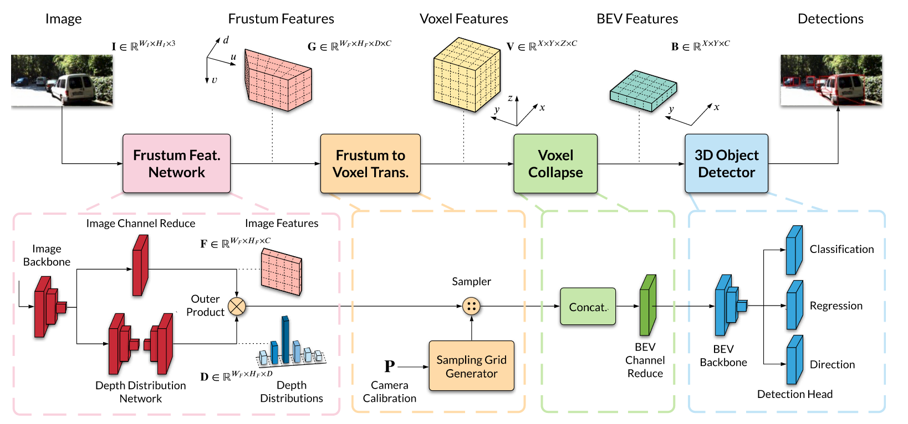
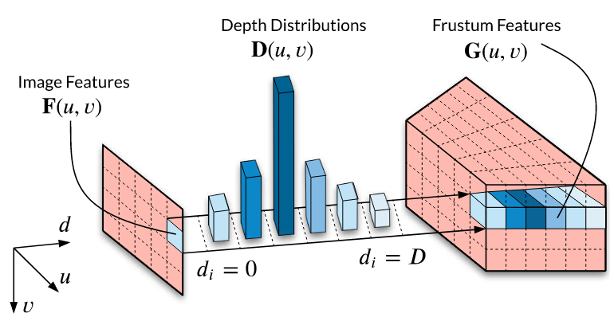
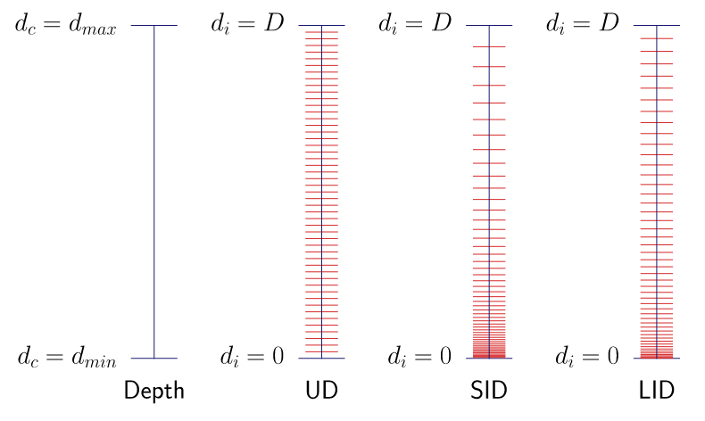

# CaDDN: Categorical Depth Distribution Network

**出处会议：** CVPR 2021  
**是否开源：** OpenPCDet包含，https://github.com/open-mmlab/OpenPCDet  
**关键词：** 视锥神经网络、三线性插值 

---

## 1. 概述

解决单目 3D 检测中深度信息缺失和特征模糊的问题。

通过预测像素级的**分类深度分布（Categorical Depth Distribution）**，将 2D 图像特征精准地投影到 3D 视锥空间，并进行**端到端（End-to-End）**的联合训练。
$$
\text{Image} \rightarrow \text{Frustum Feature Net} \rightarrow \text{Frustum-to-Voxel} \rightarrow \text{Voxel Collapse} \rightarrow \text{BEV Detection}
$$

**整体流程**：

1. **2D 空间**：提取图像特征并预测深度概率分布。
2. **2D 转 3D**：通过外积生成视锥特征，再采样转换为体素特征。
3. **3D 转 BEV**：将体素特征在高度轴压缩，形成 BEV 特征图。
4. **检测**：使用 PointPillars 检测头输出结果。

------

## 2. 方法

### 视锥特征网络 (Frustum Feature Network)

这是连接 2D 和 3D 的桥梁，核心是**外积（Outer Product）**操作。

- **输入**：RGB 图像 $I$。

- **双分支结构**：

  1. **图像特征分支 ($F$)**：
     - 提取自 ResNet-101 的 **Block 1**。
     - **为什么选 Block 1？** 为了保持**高空间分辨率**（仅下采样 4 倍），避免转换到 3D 网格时丢失几何细节。
     - 通道降维：$256 \rightarrow 64$。
  2. **深度分布分支 ($D$)**：
     - 预测每个像素属于 $D$ 个离散深度区间（Bins）的概率。
     - 输出维度：$H \times W \times D$（Categorical Distribution）。
     - **核心理念**：不回归单一深度值，而是预测分布以保留**不确定性（Uncertainty）**。

- **特征融合（外积）**：
  $$
  G(u,v) = D(u,v) \otimes F(u,v)
  $$

  - **物理意义**：将图像特征 $F$ 按照深度概率 $D$ 进行加权，沿深度轴“拉伸”。概率高的地方特征强，概率低的地方特征被抑制。
  - **解决痛点**：解决了传统方法中的特征拖影（Smearing）问题，生成的视锥特征 $G$ 更加**尖锐（Sharp）**。

### 视锥到体素转换 (Frustum to Voxel Transformation)

负责将视锥坐标系 $(u, v, d)$ 下的特征 $G$ 转换到 3D 体素坐标系 $(x, y, z)$ 下的 $V$。

- **机制**：**反向网格采样 (Grid Sampling)**。不是把视锥投出去，而c。

- 计算步骤：

  对于体素网格 $V$ 中的每一个中心点 $s^v_k = (x, y, z)$：

  1. **计算平面坐标**：利用相机投影矩阵 $P$（$3\times4$ 或扩充为 $4\times4$），将 3D 点投影回 2D 图像：
     $$
     [u, v, 1]^T \sim P \times [x, y, z, 1]^T
     $$

  2. **计算深度索引**：利用 **LID (Linear-Increasing Discretization)** 公式，将连续深度 $z$ 转换为离散索引 $d_{index}$：
     $$
     d_c = d_{min} + \frac{d_{max}-d_{min}}{D(D+1)} \cdot d_i(d_i+1)
     $$

     - *LID 优势*：相比均匀切分（UD），LID 在近处网格密（精度高），远处网格稀（适应稀疏点云），实现了更好的平衡。
  
  3. **三线性插值**：根据 $(u, v, d_{index})$ 在视锥特征图 $G$ 中采样，填充体素。
  
  利用相机参数 $P$ 和 LID 公式算出来的视锥坐标通常是**小数**（例如：$u=50.5, v=10.2, d_{index}=5.8$）。
  
  但是，我们的视锥特征图 $G$ 是离散的网格，只有整数坐标 $(50, 10, 5)$ 或 $(51, 11, 6)$ 才有数据。
  
  **三线性插值**就是解决“**如何在 8 个整数点围成的 3D 盒子里，算出任意一个小数位置的特征值**”的问题。
  
  ------
  
  **线性插值** (Linear Interpolation) — 线段
  
  想象你在一条直线上。
  
  - **已知**：点 $A$（在位置 0）的值是 10，点 $B$（在位置 1）的值是 20。
  
  - **问题**：位置 $0.6$ 处的值是多少？
  
  - 计算：根据距离加权。它离 $B$ 更近（占 0.6），离 $A$ 稍远（占 0.4）。
  
    $$Value = A \cdot (1 - 0.6) + B \cdot 0.6 = 10 \cdot 0.4 + 20 \cdot 0.6 = 16$$
  
  ------
  
  **三线性插值** (Trilinear Interpolation) — 立方体
  
  回到 CaDDN 的场景。
  
  - **场景**：视锥特征图 $G$ 是 3D 的。我们的目标采样点 $(u, v, d)$ 悬浮在一个由 **8 个邻近整数坐标点** 围成的微小立方体内部。
  
  计算过程（“拍扁”法）：
  
  我们可以把它想象成对立方体进行“降维打击”，分三步走：
  
  - **第 1 步：沿 U 轴插值（8点 $\rightarrow$ 4点）**
    - 立方体有 4 条沿着 $U$ 方向的棱。我们在每一条棱上，根据目标点在 $U$ 轴的小数位置，做 4 次线性插值。
    - *结果*：现在我们得到了 4 个面上的点。
  - **第 2 步：沿 V 轴插值（4点 $\rightarrow$ 2点）**
    - 现在剩下一个“平面”。在这个面上，我们沿着 $V$ 轴方向，对刚刚得到的 4 个点做 2 次线性插值。
    - *结果*：现在我们得到了 2 个点（一个在深度 $d$ 的前面，一个在深度 $d+1$ 的后面）。
  - **第 3 步：沿 D 轴插值（2点 $\rightarrow$ 1点）**
    - 最后，在深度方向上，根据目标点在 $D$ 轴的小数位置（比如 5.8 意味着离第 6 层更近），对这最后 2 个点做 1 次线性插值。
    - *结果*：得到最终唯一的特征值。
  
  $$
  \text{Feature} = \sum_{i,j,k \in \{0,1\}} C_{ijk} \cdot (1 - |i - x_d|) \cdot (1 - |j - y_d|) \cdot (1 - |k - z_d|)
  $$

### 3. 体素坍缩至 BEV (Voxel Collapse to BEV)

将 3D 体素“拍扁”成 2D 的鸟瞰图特征，同时保留高度信息。

- **堆叠 (Concatenation)**：将高度轴 $Z$ 的数据拼接到通道轴 $C$ 上。
  $$
  V(X, Y, Z, C) \rightarrow \tilde{B}(X, Y, Z \cdot C)
  $$
  
- **压缩 (Channel Reduction)**：使用 $1\times1$ 卷积将通道数降回 $C$。
  $$
  \tilde{B}(X, Y, Z \cdot C) \xrightarrow{1\times1 \text{ Conv}} B(X, Y, C)
  $$

  - **作用**：网络自动学习不同高度切片（如车轮高度 vs 车顶高度）的重要性并进行融合。

### BEV 3D 目标检测

- **架构**：基于 **PointPillars** 的检测头。
- **特异性修改**：**加深主干网络**。
  - 原版 PointPillars 配置：`(4, 6, 6)` 层卷积。
  - CaDDN 配置：`(10, 10, 10)` 层卷积。
  - **原因**：图像生成的 BEV 特征比 LiDAR 特征更嘈杂、质量更低，需要更大的学习容量（Learning Capacity）来提取有效特征。
- **性质**：这是一个**单阶段（Single-stage）**检测器。

------

## 3. Loss Function

CaDDN 采用多任务联合损失进行端到端训练：
$$
L = \lambda_{depth}L_{depth} + \lambda_{cls}L_{cls} + \lambda_{reg}L_{reg} + \lambda_{dir}L_{dir}
$$

### 深度分布损失 $L_{depth}$ (核心)

- **类型**：**Focal Loss** (分类任务)。
- **标签生成**：将 LiDAR 点云投影生成稀疏深度图，经补全和 LID 离散化后，转换为 **One-hot 编码**。对于一个像素，只有 1 个深度 Bin 是对的（正样本），其他 $D-1$ 个 Bin 都是错的（负样本）。
- **前景加权策略 (Object Weighting)**：
  - **前景像素**（物体框内）：$\alpha_{fg} = 3.25$。
  - **背景像素**：$\alpha_{bg} = 0.25$。
  - **目的**：强迫网络优先关注前景物体的深度准确性，忽略背景误差。

### 检测损失 (源自 PointPillars)

- **$L_{cls}$**：Focal Loss，用于类别分类。
- **$L_{reg}$**：Smooth L1 Loss，回归 7 个框参数 $(x, y, z, w, l, h, \theta)$。
- **$L_{dir}$**：Softmax Cross Entropy，二分类判断车头朝向（正/反），解决 180° 二义性。

------

## 4. 消融实验

#### Table 3: CaDDN 内部模块消融 (CaDDN Ablation Experiments)

这张表旨在验证 CaDDN 提出的各个组件（深度预测、监督、加权、离散化）是否真的有效。它通过逐步添加模块的方式展示了性能的提升路径。

| **Exp.** | **D (预测分布)** | **Ldepth (深度监督)** | **αfg (前景加权)** | **LID (离散化)** | **核心作用解析**                                             |
| -------- | ---------------- | --------------------- | ------------------ | ---------------- | ------------------------------------------------------------ |
| **1**    | $\times$         | $\times$              | $\times$           | UD               | **Baseline (特征拖影)** 不预测深度，直接把图像特征沿着视锥射线均匀复制。这模拟了无深度信息的隐式投影方法，导致特征在 3D 空间严重拖影（Smearing）。 **结果**：效果最差，证明盲目投影不可行。 |
| **2**    | $\checkmark$     | $\times$              | $\times$           | UD               | **无监督深度学习** 网络预测深度分布 $D$ 用来加权特征，但是**没有**使用 LiDAR 真值进行监督 ($L_{depth}$)，让网络自己学。 **结果**：提升微乎其微 (+1.5% AP)。证明仅靠检测损失无法让网络学到准确的几何深度。 |
| **3**    | $\checkmark$     | $\checkmark$          | $\times$           | UD               | **有监督深度学习 (Supervision)** 加入了 $L_{depth}$，利用 LiDAR 生成的 One-hot 标签强迫网络输出尖锐的分布。 **结果**：**性能暴涨 (+10.4% AP)**。这是全表最大的提升，证明了**显式的深度监督是核心**，它让特征能聚焦在正确的位置。 |
| **4**    | $\checkmark$     | $\checkmark$          | $\checkmark$       | UD               | **前景加权 (Object Weighting)** 在计算 Focal Loss 时，对前景物体像素赋予高权重 ($\alpha_{fg}=3.25$)，背景赋予低权重。 **结果**：进一步提升 (+0.6%~1% AP)。证明解决前景/背景不平衡，让网络“关注物体”对检测很重要。 |
| **5**    | $\checkmark$     | $\checkmark$          | $\checkmark$       | $\checkmark$     | **LID 离散化 (Full CaDDN)** 将深度划分方式从均匀 (UD) 改为线性递增 (LID)。 **结果**：最终提升 (+3.17% AP)。证明 LID 在近处的高精度和远处的稀疏性之间取得了更好的平衡。 |

------

#### Table 4: 深度估计策略消融 (Depth Estimation Ablation)

这张表旨在对比 CaDDN 与其他“两阶段”或“硬分类”方法的区别，回答了“为什么要联合训练”和“为什么要用概率分布”这两个问题。

| **Exp.** | **D 来源** | **Ldepth 训练方式** | **⊗ (Soft vs Hard)**    | **核心配置与作用解析**                                       |
| -------- | ---------- | ------------------- | ----------------------- | ------------------------------------------------------------ |
| **1**    | **BTS**    | **分步**            | Hard                    | **SOTA 深度图基准 1** 先用预训练好的 BTS 网络生成深度图，**固定参数**，转换成 One-hot 编码输入给 CaDDN 检测头。这是典型的“两阶段”做法。 **作用**：作为强力基准，测试通用的深度估计对检测有多大帮助。 |
| **2**    | **DORN**   | **分步**            | Hard                    | **SOTA 深度图基准 2** 同上，使用 DORN 网络生成深度图。 **作用**：DORN 是当时很强的深度估计器，用来证明 CaDDN 是否能超越这些通用网络。 |
| **3**    | **CaDDN**  | **分步**            | Hard                    | **CaDDN 分步训练版** 使用 CaDDN 的结构，但是**先把深度分支训练好，冻结参数**，再训练检测头。 **作用**：控制变量。对比 Exp 3 和 Exp 1/2，发现 CaDDN 的深度结构本身略好于 BTS/DORN，但优势不大。 |
| **4**    | **CaDDN**  | **联合**            | **Hard ($\times$)**     | **联合训练 + 硬选择 (Hard Selection)** 开启端到端联合训练，但在生成视锥特征时，**只取概率最大的那个深度 Bin** (Argmax)，丢弃其他概率值。 **作用**： 1. 对比 Exp 4 vs 3：证明**联合训练**有效 (+2.97% AP)，因为深度模块会为了适应检测任务而优化。 2. 此时丢失了“不确定性”信息。 |
| **5**    | **CaDDN**  | **联合**            | **Soft ($\checkmark$)** | **联合训练 + 软分布 (Full Distribution)** 使用完整的概率分布进行外积操作 ($G = D \otimes F$)。 **作用**：对比 Exp 5 vs 4，性能显著提升 (+2.96% AP)。 **结论**：证明保留深度的**不确定性（Uncertainty）**至关重要。如果网络拿不准，把特征分散在多个深度 Bin 里比武断地选一个（可能选错）要好得多。 |

1. **深度必须监督**：不要指望网络在做检测任务时顺便学会深度，必须用 LiDAR 真值手把手教 (Table 3 Exp 3)。
2. **不仅要准，还要专**：通用的深度估计网络（BTS/DORN）不如专门为了检测任务而联合训练的网络 (Table 4 Exp 4 vs 1/2)。
3. **不要太绝对**：保留概率分布（Soft）比直接选一个深度值（Hard）有更高的容错率，是单目 3D 检测的关键 (Table 4 Exp 5 vs 4)。
4. **细节决定成败**：前景加权 ($\alpha_{fg}$) 和 LID 离散化这些工程细节对最终达到 SOTA 贡献显著。
