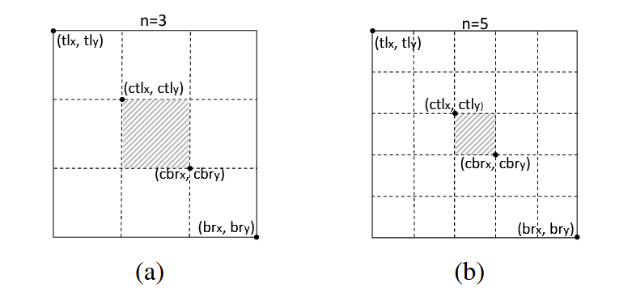
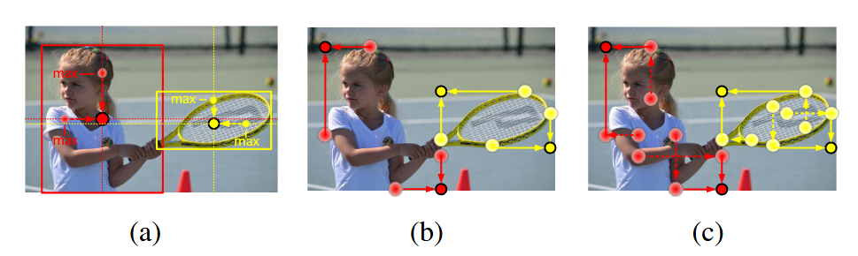
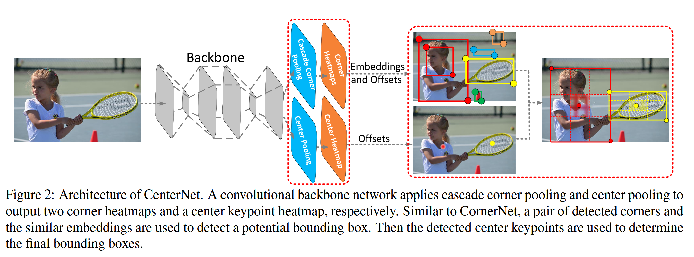

# CenterNet：Keypoint Triplets

**出处会议：** ICCV 2019  
**是否开源：** 是，https://github.com/Duankaiwen/CenterNet  
**关键词：** 关键点三元组、中心点验证、中心池化、级联角点池化

---

## 方法

**背景** ：CornerNet 的痛点： CornerNet 通过检测左上角和右下角来确定物体，但它**缺乏对边界框内部区域的感知能力** 。

- 容易产生大量错误的边界框，即：即使两个角点匹配得很好，框里面可能根本没有物体。
- CornerNet 在小物体上错误发现率高。

**核心方法：** 将物体检测建模为 **关键点三元组 (Keypoint Triplets)**：左上角、右下角 和 中心点。

中心点的验证逻辑 是 如果一个边界框是正确的，那么在其**中心区域**应该能检测到一个同类别的中心点。

**中心区域的定义**：朴素的 N 等分，取中心。

- **自适应策略：** 为了适应不同大小的物体，中心区域的大小是可变的：
  - 小物体 ($Scale < 150$)：区域相对较大 ($n=3$)，保证**召回率**。
  - 大物体 ($Scale > 150$)：区域相对较小 ($n=5$)，保证**精确度**。

Scale（尺度） 指的是物体边界框（Bounding Box）的大小，面积。

**中心池化 (Center Pooling)**

- **问题：** 物体的几何中心往往没有显著的视觉特征，例如甜甜圈的中间是空的。
- **方法：** 在特征图上的某点，分别获取其**水平方向**和**垂直方向**的最大值，然后**相加**。
- **目的：** 让中心点能够感知到物体在整个十字交叉方向上的视觉模式，使其更容易被检测到。

**级联角点池化 (Cascade Corner Pooling)**

- **问题：** 传统的 Corner Pooling 只沿边界寻找最大值（Look Boundary），导致角点对边缘敏感，但缺乏物体内部信息。
- **方法：** **级联 (Cascade)** 操作：
  1. 先沿边界寻找最大值，和以前一样。
  2. 再从边界最大值位置向**物体内部**寻找最大值。
  3. 两者相加。
- **目的：** 让角点既包含边界信息，又包含物体的内部特征，提高鲁棒性。

**网络架构**

- **Backbone:** 使用 **Hourglass Network** (52层或104层) 。

- **输出头 (Heads):**

  - 两组角点热图 (TL, BR) + Embedding + Offsets。
  - **一组中心点热图 (Center Heatmap)**。

  **推断流程：** 依然是单阶段 (One-stage)。不需要 RoI Pooling。

------

## 消融实验

**基线模型：** CornerNet511-52（输入分辨率 $511\times511$，骨干网络 Hourglass-52）。

**实验方法：** 在基线模型上，依次叠加三个核心组件，观察 AP（平均精度）的变化。

1. **CRE (Central Region Exploration):** 中心区域探索（即引入中心点热图）。
2. **CTP (Center Pooling):** 中心池化。
3. **CCP (Cascade Corner Pooling):** 级联角点池化。

### **第一步：引入中心区域探索 (CRE)**

- **操作：** 在 CornerNet 基础上增加一个中心点热图分支。此时中心点检测仅使用普通卷积，未加特殊池化 。
- **结果：** AP 从 37.6% 提升到 **39.9%** (+2.3%) 。
- **关键发现：**
  - **小物体 (Small Objects) 受益最大：** $AP_S$ 提升了 4.6% 。
  - **大物体 (Large Objects) 几乎没变：** $AP_L$ 仅从 52.2% 变到 52.3%。
- **解释：** 小物体由于尺寸小，一旦位置偏一点，中心点很容易落到框外，因此中心点验证能非常高效地过滤掉小物体的误检框。而大物体容错率高，普通卷积也能蒙对，所以仅加中心点分支对大物体帮助有限。

### **第二步：引入中心池化 (CTP)**

- **操作：** 在中心点分支中，用 **Center Pooling** 模块替换普通卷积。
- **结果：** AP 从 39.9% 提升到 **40.8%** (+0.9%)。
- **关键发现：**
  - **大物体 (Large Objects) 爆发：** $AP_L$ 显著提升了 1.4% (从 52.3% 到 53.6%)。
- **解释：** 大物体的几何中心往往没有明显的纹理（比如人的中心在衣服上）。普通卷积很难提取特征，但 **Center Pooling** 能够从水平和垂直方向“借”来边缘的特征，让大物体的中心变得可识别。

### **第三步：引入级联角点池化 (CCP)**

- **操作：** 将原 CornerNet 的角点池化替换为 **Cascade Corner Pooling**（即“先看边，再看里”）。
- **结果：** AP 从 40.8% 提升到 **41.3%** (+0.5%)。
- **关键发现：**
  - **再次增强大物体：** 结合 CenterNet 使用时，$AP_L$ 进一步提升到了 55.8% 。
- **解释：** 级联池化让角点能感知物体内部信息。虽然这可能引入一些内部噪声，但配合 CenterNet 的中心点验证功能，可以有效抑制噪声，同时保留对大物体定位的鲁棒性。

------

### 错误分析 (Error Analysis)

作者还做了一个非常有启发性的实验（Table 5）：**如果中心点检测是 100% 准确的，效果会怎样？**

- **操作：** 在推断时，不使用网络预测的中心点，而是直接使用**真实标签（Ground Truth）**的中心点来过滤框。
- **结果：** AP 直接从 41.3% 飙升到了 **56.5%** 。
- **结论：** 这说明 CenterNet 的上限非常高。目前的性能瓶颈主要在于**中心点检测还不够准**。只要能更准确地找到中心点，检测性能还能大幅提升 。

**总结**：

1. **CRE (中心点验证)** 主要解决了**小物体**的误检问题（过滤空框）。
2. **CTP (中心池化)** 专门为了解决**大物体**中心特征不明显的问题（特征增强）。
3. **CCP (级联角点池化)** 进一步提升了角点定位的鲁棒性，特别是针对**大物体**。
4. 这三个组件环环相扣，最终实现了从 37.6% 到 41.3% 的显著提升。
