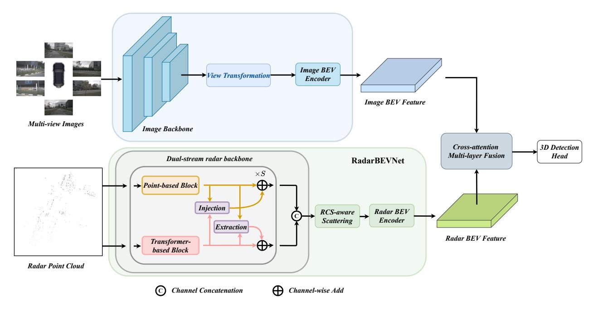
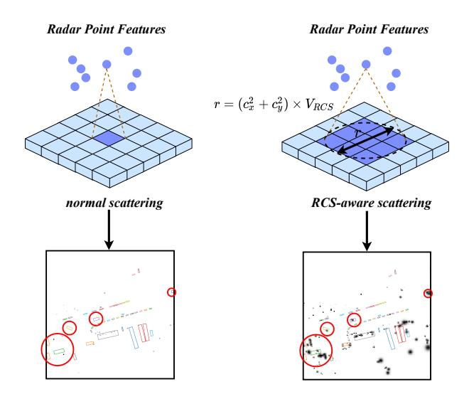
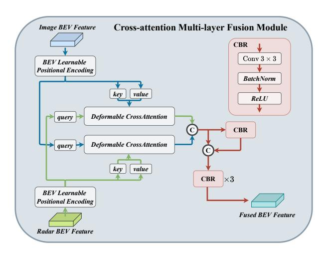

# RCBEVDet

**出处会议：** CVPR 2024  
**是否开源：** https://github.com/VDIGPKU/RCBEVDet  
**关键词：** 雷达-摄像头融合、BEV特征提取、交叉注意力融合、RadarBEVNet

---

这篇文章的核心逻辑是：**如何更好地提取雷达特征**，解决雷达稀疏、无语义的问题，以及**如何更好地将雷达与摄像头特征融合**。

方法主要分为两个大模块：
1.  **RadarBEVNet**：专门设计的雷达特征提取网络。
2.  **CAMF (Cross-Attention Multi-layer Fusion)**：交叉注意力多层融合模块。

---

## 一、 整体架构

整个系统是一个并行的双流结构：
*   **图像流 (Image Stream)**：标准的摄像头处理流程。输入多视角图像 -> 图像骨干网络 (Image Backbone) 提取特征 -> 视角转换 (View Transformation) 转换到 BEV 空间 -> 得到 **Image BEV Feature**。
*   **雷达流 (Radar Stream)**：这是本文的创新重点。输入雷达点云 -> **RadarBEVNet** -> 得到 **Radar BEV Feature**。
*   **融合与检测**：两者在 **CAMF 模块** 中对齐和融合，最后送入 3D 检测头 (Head)。

---

## 二、 RadarBEVNet：雷达特征提取 

### 1. 双流雷达骨干网络

为了兼顾雷达点的“局部细节”和“全局上下文”，作者设计了两个并行的分支：

**基于点的流 (Point-based Stream - Fig 3a)**：

*   **作用**：处理局部特征。
*   **结构**：类似于 PointNet。对每个雷达点使用 MLP 升维，然后通过最大池化 (Max Pooling) 聚合信息，再拼接到原始特征上。
*   **特点**：保留了每个点的独立特征。

**基于 Transformer 的流 (Transformer-based Stream - Fig 3b)**：

*   **作用**：捕捉全局上下文信息，即点与点之间的关系。
*   **创新点 - 距离调制自注意力 (DMSA)**：
    *   标准的 Transformer 全局注意力计算量大且难以收敛。
    *   **DMSA** 引入了一个高斯权重掩码（Gaussian-like weight map）。距离越近的点，注意力权重越高；距离越远，权重越低。这让网络在初期更容易关注邻域信息，加速收敛。

**注入与提取模块 (Injection & Extraction Module - Fig 4)**：

*   这是连接上述两个流的“桥梁”。这两个流不是各跑各的，而是每一层都在交互。
*   **Injection (注入)**：把 Transformer 流提取的全局特征，通过交叉注意力（Cross-Attention）“注入”到 Point 流中。
*   **Extraction (提取)**：把 Point 流的特征，通过交叉注意力“提取”出来更新 Transformer 流。
*   **结果**：两个流的信息充分互补。

### 2. RCS 感知 BEV 编码器 ：利用RCS，把稀疏点云补成稠密图像。

在这一步之前，我们得到的还是**点云形式**的特征（一系列点的集合）。但是，摄像头提取出来的特征是**图像形式**（BEV 图像，即 $H \times W \times C$ 的网格）。

要把这两者融合，必须先把雷达点云转换成 BEV 图像。

#### **传统做法 (Normal Scattering)** ：

​	假设一个雷达点坐标是 $(10.2, 5.8)$，那就把它的特征填进网格 $(10, 6)$ 这个像素里。雷达点太少了！一个 $128 \times 128$ 的 BEV 图可能有 16000 个像素，但雷达点可能只有几百个。结果就是**图上全是 0，只有零星几个点有值**。后续的卷积神经网络（CNN）很讨厌这种极度稀疏的数据，很难提取出物体的形状。

#### **RCS 感知 BEV 编码器 （RCS-aware Scattering）**

​	RCS 值越大，说明这个物体反射雷达波的能力越强，通常意味着**物体越大**（比如大货车的 RCS 远大于行人）。既然 RCS 代表物体大小，那我为什么要把一个大卡车的雷达点只画成一个像素呢？我应该把它画成一个**圆斑**。

对于每一个雷达点，根据它的坐标 $(c_x, c_y)$ 和 RCS 值 $V_{RCS}$，计算它在 BEV 图上应该占据多大的范围。

$$
r = (c_x^2 + c_y^2) \times V_{RCS}
$$
​	**注意**：这里乘上坐标平方 $(c_x^2 + c_y^2)$ 其实是在考虑**距离因素**。因为远处的物体在 BEV 投影上通常会因为角度分辨率问题显得更模糊/更大，或者作为一种距离补偿。但核心在于 $V_{RCS}$ 控制了相对大小。

​	确定了半径 $r$ 后，不是简单地画一个实心圆，而是画一个**高斯分布的圆斑**。这其实就是一个以雷达点为中心的高斯函数，中心权重最高，边缘权重逐渐降低。

$$
G_{x,y} = \exp\left(-\frac{(c_x - x)^2 + (c_y - y)^2}{\text{系数} \times V_{RCS}}\right)
$$

现在，每个雷达点不再是一个点了，而是一个**自带权重的光斑**。我们将这个点的特征向量 $f$，乘上这个高斯权重图 $G$。把所有雷达点的这些“光斑”叠加到 BEV 网格上。如果两个点的光斑重叠了，通常采用 `Sum Pooling`（求和）或者 `Max Pooling`（取最大值）来聚合。论文里提到用了 Sum Pooling。

#### 第四步：拼接与 MLP
最后，为了保留最原始的信息，作者把：**RCS 散布后的特征** $f_{RCS}$ 和 **生成的高斯权重图本身** $G_{RCS}$ 作为一种空间注意力图拼在一起，过一个 MLP 融合一下，得到最终的 **RCS-aware BEV Feature**。

对比图 5 下方的两张效果图，一目了然。

​	**左图 (Normal)**稀稀拉拉的几个点，根本看不出哪里是车，哪里是路

​	**右图 (RCS-aware)**：点变成了**团块**。你可以隐约看出物体的**轮廓**和**占用区域**。这种**稠密 (Dense)** 的特征图，对于后续的卷积网络来说，非常容易提取形状和语义特征。

---

## 三、 CAMF：交叉注意力多层融合

如果说 **RadarBEVNet** 是为了让雷达数据“支棱起来”（从稀疏点变成稠密特征），那么 **CAMF** 就是为了让雷达和摄像头这对“性格不合”的搭档**完美配合**。

这个模块主要解决一个核心痛点：**空间未对齐 (Spatial Misalignment)**。
> *雷达虽然测距准，但在水平方位角（Azimuth）上经常有抖动和误差。如果直接把雷达图和摄像头图叠在一起（简单的 Concat），就像两张透写纸没对齐，影子是重影的，神经网络会学晕。

### **第一步：基于可变形交叉注意力的对齐 (Alignment)**

这一步是 CAMF 的灵魂。它的目标不是简单的“叠加”，而是**“互相纠错”**。

普通的 Attention 是全局的，看全图，计算量太大 ($H \times W$ 的平方级)。
**可变形注意力 (Deformable Attention)** 只看几个关键的参考点。它会学习一个**偏移量 (Offset)**，自动去寻找“应该看哪里”。

*   *比如：雷达显示车在坐标 (10, 10)，但因为误差，摄像头图像里的车其实在 (10.2, 9.8)。Deformable Attention 能自动学会这个偏移，把视线挪过去。*

论文设计了一个双向的交互（公式 10）：

*   **路线 A：雷达修正摄像头 ($F_c \leftarrow F_r$)**
    *   **Query**: 雷达特征 $z_{q_r}$。
    *   **Key/Value**: 摄像头特征 $F_c$。
    *   **逻辑**：雷达特征作为提问者，根据自己的位置，去摄像头特征图里找对应的纹理。如果雷达觉得“这里应该有车”，它会引导摄像头特征往这边聚焦，修正视觉特征的位置偏差。

*   **路线 B：摄像头修正雷达 ($F_r \leftarrow F_c$)**
    *   **Query**: 摄像头特征 $z_{q_c}$。
    *   **Key/Value**: 雷达特征 $F_r$。
    *   **逻辑**：摄像头特征作为提问者，去雷达特征图里找深度和速度信息。如果视觉上看到这里有个车轮，它会去雷达图里“抓取”对应的反射点特征，哪怕那个反射点稍微偏了一点点。

**结果**：经过这一轮互相“拉扯”和“校准”，两个特征图在空间上就**对齐**了。

### **第二步：通道与空间融合 (Channel and Spatial Fusion)**

对齐之后，虽然位置准了，但它们还是两张独立的皮（两个 Feature Map）。这一步要把它们**揉碎了融合在一起**。

#### 1. 拼接 (Concat)
首先，把对齐后的摄像头特征 $F_c$ 和雷达特征 $F_r$ 在通道维度上拼起来：
$$
F_{multi} = [F_c, F_r]
$$

#### 2. CBR 模块 (卷积大乱炖)
接下来是一系列的 **CBR** (Conv $3\times3$ + BatchNorm + ReLU) 操作。
*   **第一层 + 残差**：
    *   先过一个 CBR 块。
    *   然后有一个**残差连接 (Residual Connection)**（图中的红色箭头绕过第一个 CBR）。这意味着即使融合层没学好，至少能保留原始拼接的信息，保证“不退步”。
*   **后续三层**：
    *   接着再串联 3 个 CBR 块。
    *   **目的**：通过多层卷积，让雷达的物理特征（RCS、速度）和摄像头的语义特征（纹理、形状）在通道和空间上深度混合，提取出**更高级的特征**（比如：“这是一个正在快速移动的金属物体”）。

---

### 总结：CAMF 强在哪里？

我们在看论文对比（Figure 9）时会发现，它和 CRN (另一个 SOTA 方法) 的区别在于：

1.  **CRN (Fusion-then-Alignment)**：先把没对齐的图拼在一起，然后再去修修补补。
    *   *比喻：先把两张错位的照片叠在一起打印出来，然后再用 PS 去修重影。*
2.  **RCBEVDet 的 CAMF (Alignment-then-Fusion)**：先各自对齐，再拼在一起。
    *   *比喻：先把两张照片完全对准，然后再叠在一起打印。*

显然，CAMF 的逻辑更顺，不仅解决了雷达的**方位角误差**，还保留了更纯净的多模态信息。这就是为什么在鲁棒性实验中，它比 CRN 更稳的原因。

---

### 四、 总结：为什么这个方法好？

1.  **更懂雷达**：没有生搬硬套 LiDAR 的方法，而是专门设计了双流网络处理点云，利用 RCS 属性解决稀疏问题。
2.  **容忍误差**：考虑到雷达不准，用 Deformable Attention 让特征自动对齐，而不是强行对应坐标。
3.  **速度与精度平衡**：在保持高精度的同时，设计上（如 DMSA、Deformable Attention）都考虑了计算效率，所以能达到 20+ FPS 的实时速度。
