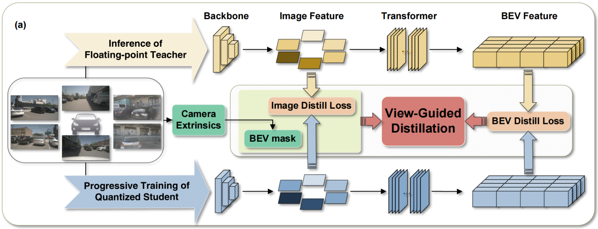
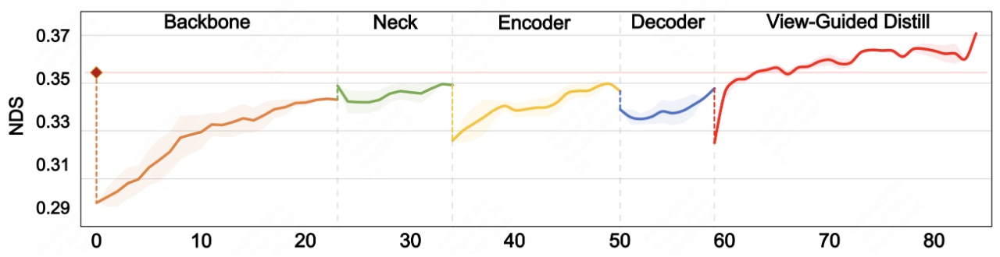
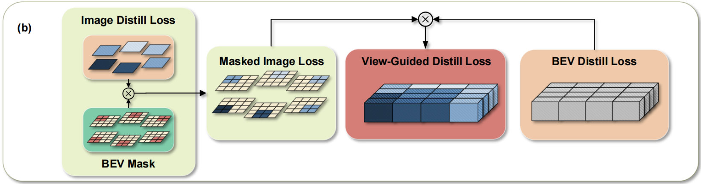

# QD-BEV: 多视角 3D 目标检测的量化感知视点引导蒸馏

**出处会议：** ICCV 2023  
**是否开源：** https://github.com/Niko-zyf/QD-BEV  
**关键词：** 量化感知训练、知识蒸馏、BEV感知、渐进式量化

---

## 1. 概述

**QD-BEV** 旨在解决多视角 3D 检测模型（如 BEVFormer）在量化过程中面临的两个核心痛点：**训练不稳定（梯度爆炸/不收敛）和 性能剧烈下降**。

该方法通过“分阶段渐进式量化”稳住训练初期，再利用“视点引导蒸馏（VGD）”在极低位宽（如 W4A6）下恢复甚至超越全精度模型的性能。

------

## 2. 方法

### 1、整体流水线

采用 **教师-学生（Teacher-Student）** 蒸馏架构：

- **Teacher** 是冻结的预训练 FP32 全精度模型、**Student** 是待训练的低比特量化模型。
- **核心逻辑**：多视角图像输入后，分别经过主干网络提取图像特征 。随后进入 Transformer 模块生成 BEV 特征 。系统在“图像特征”和“BEV 特征”两个维度上分别计算蒸馏损失。

### 2、量化感知训练 (QAT)

#### 量化公式

采用对称线性量化（Symmetric Linear Quantization）：

$$
q = \text{round}\left(\frac{r}{S}\right), \quad S = \frac{2|r_{\max}|}{2^k - 1}
$$

- **$r$**：待量化的原始浮点值。
- **$S$ (Scale Factor)**：量化步长，决定了每个整数阶梯代表多大的浮点数值。
- **分子中的 "2"**：由于是对称量化，浮点值域跨度从 $-|r_{\max}|$ 到 $+|r_{\max}|$ ，总跨度为 $2|r_{\max}|$ 。
- **分母中的 "$2^k - 1$"**：对于 $k$-bit 量化，总共有 $2^k$ 个离散阶梯，而这些阶梯之间存在 $2^k-1$ 个间隔。该分母确保了浮点范围被均匀地切割。

#### 渐进式策略 (Progressive QAT)

为了解决标准 QAT 一次性量化全网导致的训练崩溃，作者将量化过程分为四个阶段，按敏感度排序逐步引入：

$$
Backbone \rightarrow Neck\rightarrow Encoder \rightarrow Decoder
$$

**量化流程：**在当前循环中，仅对该模块执行量化操作（将权重/激活压入低比特），而尚未轮到的模块保持高精度。 

**独立训练**：在每个子阶段（ $N_i$ 个 Epoch）内，仅通过最小化标准的 **QAT Loss** 来更新参数，让模型逐步适应新增的量化扰动。

### 2.3 视点引导蒸馏 (VGD)

#### 特征分布映射 ($\phi_{\tau}$)

为了计算 KL 散度，需要将特征图 $F$ 转换为概率分布：

$$
\phi_{\tau}(x_{i}) = \frac{e^{x_{i}/\tau}}{\sum_{j}e^{x_{j}/\tau}}
$$

- **$\tau$ (Temperature)**：温度系数。 $\tau > 1$ 会平滑分布，让学生模型关注教师输出中较小的非零特征（即“软知识”） 。

#### 图像与 BEV 特征蒸馏损失

- **图像损失 ($\mathcal{L}_{img}$)**：在图像 Neck 输出端计算。

  $$
  \mathcal{L}_{img} = \frac{\tau^2}{BWHC} \times \mathcal{D}_{KL}(\phi_{\tau}(F_{img}^T), \phi_{\tau}(F_{img}^S))
  $$

- **BEV 损失 ($\mathcal{L}_{bev}$)**：在 Transformer 输出端计算。

  $$
  \mathcal{L}_{bev} = \frac{\tau^2}{BC} \times \mathcal{D}_{KL}(\phi_{\tau}(F_{bev}^T), \phi_{\tau}(F_{bev}^S))
  $$

**$T/S$**：分别指代 Teacher 和 Student 的特征。 $\tau^2$ 缩放因子用于保持梯度稳定。

#### VGD 目标函数与门控机制

$$
\mathcal{L}_{vgd} = \sum_{i=1}^{N \cdot H \cdot W} \hat{\mathcal{L}}_{img} \odot \mathcal{L}_{bev}
$$

- **$\hat{\mathcal{L}}_{img}$ 的含义**： $\mathcal{L}_{img}$ 原本是一个视角一个标量。加上 "hat" 代表将其通过 **Hadamard 积 ($\odot$)** 扩展到了 BEV 空间维度。
- **$M_{bev}$ (BEV Mask) 的来源**：利用相机的**外部参数（外参）**，将 3D BEV 网格点投影到 2D 图像平面。若点在视角内则 Mask 为 1，否则为 0。
- **门控逻辑**：
  1. **空间门控**：只有当 BEV 空间某点落入特定相机视野时， $M_{bev}$ 才有效，这保证了“正确的图像特征指导正确的 BEV 空间”。
  2. **跨域门控**： $\hat{\mathcal{L}}_{img}$ 与 $\mathcal{L}_{bev}$ 逐元素相乘，意味着只有当两个域的预测都出现偏差时，产生的梯度才最强，强制模型聚焦于最难学习的特征。

------

## 3. 实验结果分析

### 3.1 模块量化敏感度分析 (Table 1)

作者对各模块单独量化以确定其影响。

| **量化模块 (W4A6)**   | **BEV-Tiny (NDS)** | **BEV-Small (NDS)** | **BEV-Base (NDS)** |
| --------------------- | ------------------ | ------------------- | ------------------ |
| **全精度 (Baseline)** | **0.354**          | **0.479**           | **0.517**          |
| 仅 Backbone           | 0.310              | 0.417               | 0.440              |
| 仅 Neck               | 0.353              | 0.478               | 0.516              |
| 仅 Encoder            | 0.295              | 0.421               | 0.303              |
| 仅 Decoder            | 0.353              | 0.477               | 0.517              |

**分析**：**Backbone 和 Encoder 是核心瓶颈**，量化后精度跌落最严重。Neck 和 Decoder 对量化高度不敏感。

### 3.2 PTQ 不同位宽的表现 (Table 2)

测试不训练直接量化的极限。

| **位宽 (W/A)** | **模型**    | **NDS**       | **NDS 下降比** | **mAP**       |
| -------------- | ----------- | ------------- | -------------- | ------------- |
| **W32A32**     | Tiny / Base | 0.354 / 0.517 | -              | 0.252 / 0.416 |
| **W8A8**       | Base        | 0.487         | 5.8%           | 0.384         |
| **W6A6**       | Base        | 0.402         | 22.2%          | 0.262         |
| **W4A6**       | Base        | 0.226         | 56.3%          | 0.076         |
| **W4A4**       | Base        | 0.023         | 95.6%          | 0.000         |

**分析**：当位宽低于 8-bit 后，PTQ 性能崩塌。**4-bit 下模型近乎失效**，必须引入 QAT 和蒸馏。

### 3.3 渐进式 QAT 与标准 QAT 对比 (Table 3)

验证分阶段训练的稳定性。

| **方法**            | **模型** | **NDS**   | **NDS Drop** | **mAP**   |
| ------------------- | -------- | --------- | ------------ | --------- |
| **Standard QAT**    | Base     | 0.224     | 56.7%        | 0.071     |
| **Progressive QAT** | Base     | **0.485** | **6.2%**     | **0.376** |

**分析**：渐进式策略显著缓解了量化扰动，使大模型（Base）在 4-bit 下依然能维持极高精度。

### 3.4 QD-BEV 综合对比实验 (Table 4)

与其它量化算法（DFQ, HAWQ, PACT）及全精度 Baseline 对比。

| **模型**            | **模型大小** | **NDS↑**  | **mAP↑**  | **mATE↓** | **mASE↓** |
| ------------------- | ------------ | --------- | --------- | --------- | --------- |
| BEVFormer-T (FP32)  | 126.8 MB     | 0.354     | 0.253     | 0.899     | 0.294     |
| **QD-BEV-T (W4A6)** | **15.9 MB**  | **0.372** | **0.255** | **0.882** | **0.321** |
| BEVFormer-B (FP32)  | 262.9 MB     | 0.517     | 0.416     | 0.672     | 0.273     |
| **QD-BEV-B (W4A6)** | **32.9 MB**  | **0.509** | **0.406** | **0.691** | **0.285** |

**分析**：QD-BEV 在模型**体积压缩 8 倍**的情况下，Tiny 版本的精度甚至**反超**了 FP32 Baseline，Base 版本的性能损失也控制在 1% 以内。

### 3.5 流式感知实时性评估 (Table 6)

验证量化对真实自动驾驶延迟的影响。

| **输入分辨率** | **模型**     | **位宽** | **mAP** | **sAP (流式指标)↑** |
| -------------- | ------------ | -------- | ------- | ------------------- |
| 900x1600       | BEVFormer-B  | 32/32    | 0.416   | 0.136               |
| 900x1600       | **QD-BEV-B** | **4/6**  | 0.406   | **0.337**           |

**分析**：由于 FP32 模型推理延迟高，在动态驾驶环境中 sAP 极低。**QD-BEV 通过量化加速，将 sAP 提升了近 1.5 倍**，证明了量化对实时感知的价值。

------

## 4. 总结笔记

1. **策略**：分阶段（渐进式）量化解决“练不动”的问题，视点引导蒸馏解决“精度丢”的问题。
2. **创新点**：利用相机外参做 Loss 的空间重分布，实现了图像域与 BEV 域的跨时空联合优化。
3. **效果**：W4A6 位宽下实现 8 倍压缩，且在实时感知指标（sAP）上大幅领先全精度模型。
