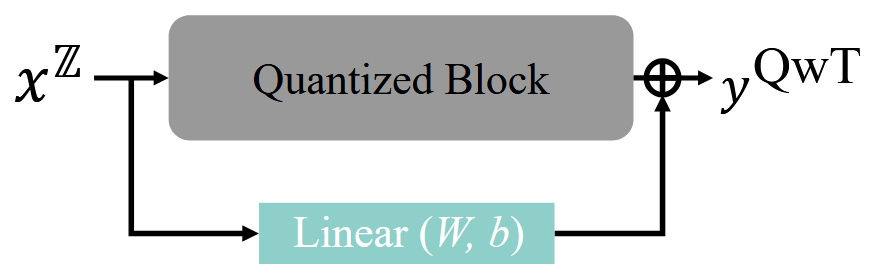

# Quantization without Tears (QwT)

**出处会议：** CVPR 2025  
**是否开源：** https://github.com/wujx2001/QwT  
**关键词：** 线性补偿层

---

## 1. 概述

传统量化方法通常遵循 **$S^{\mathbb{Z}} = S$** 的原则，即量化后的模型结构必须与原模型完全一致。

QwT 提出了全新的范式，允许量化模型的结构发生微小变化，即 $S^{\mathbb{Z}} = S \cup S_c$。在量化后的每一个网络块（Block）后面并联一个极其轻量级的线性补偿层 $S_c$。

------

## 2. 数学实现与闭式解推导

QwT 的精髓在于将复杂的量化误差修复问题转化为一个简单的**线性回归问题**，从而直接求得闭式解（Closed-form Solution），无需繁琐的反向传播。

### 问题建模

设全精度块的输出为 $y$，量化块的输入为 $x^{\mathbb{Z}}$，量化块的输出为 $y^{\mathbb{Z}}$。引入线性补偿层 $c(x^{\mathbb{Z}}) = Wx^{\mathbb{Z}} + b$，使得：

$$
y^{QwT} = l^{\mathbb{Z}}(x^{\mathbb{Z}}) + (Wx^{\mathbb{Z}} + b)
$$
目标是最小化残差的平方和：

$$
\min_{W, b} || y -  y^{QwT}||^2 \\ = 
\min_{W, b} || y - (y^{\mathbb{Z}} + Wx^{\mathbb{Z}} + b) ||^2
$$
为了简化计算，将偏置 $b$ 合并到权重矩阵 $W$ 中。

### 闭式解公式

设已吸收偏置后的增强输入矩阵为 $X^{\mathbb{Z}} \in \mathbb{R}^{(d_{in}+1) \times N}$，待求解的残差矩阵为 $E = Y - Y^{\mathbb{Z}} \in \mathbb{R}^{d_{out} \times N}$ 。

我们希望找到权重矩阵 $W$，最小化均方误差。其代价函数 $L(W)$ 可以表示为 Frobenius 范数的平方：
$$
L(W) = \|E - W X^{\mathbb{Z}} \|_F^2 = \text{tr} \left( (E - W X^{\mathbb{Z}}) (E - W X^{\mathbb{Z}})^\top \right)
$$
展开迹函数项：
$$
L(W) = \text{tr}(EE^\top) - \text{tr}(EX^{\mathbb{Z}\top}W^\top) - \text{tr}(W X^{\mathbb{Z}} E^\top) + \text{tr}(W X^{\mathbb{Z}} X^{\mathbb{Z}\top} W^\top)
$$
利用矩阵迹的性质（$\text{tr}(A) = \text{tr}(A^\top)$ 和 $\frac{\partial \text{tr}(AXB)}{\partial X} = A^\top B^\top$），我们对 $W$ 求偏导：
$$
\frac{\partial L}{\partial W} = -2 E X^{\mathbb{Z}\top} + 2 W X^{\mathbb{Z}} X^{\mathbb{Z}\top}
$$
令偏导数为 $0$，得到线性回归的最优性条件：
$$
W X^{\mathbb{Z}} X^{\mathbb{Z}\top} = E X^{\mathbb{Z}\top}
$$
由于我们需要求 $W$，且 $X^{\mathbb{Z}} X^{\mathbb{Z}\top}$ 是一个 $(d_{in}+1) \times (d_{in}+1)$ 的半正定矩阵（在采样数 $N$ 足够大时通常是满秩且可逆的），我们直接右乘其逆矩阵：
$$
W^* = E X^{\mathbb{Z}\top} (X^{\mathbb{Z}} X^{\mathbb{Z}\top})^{-1}
$$
将 $E = Y - Y^{\mathbb{Z}}$ 代入，即得到论文中的闭式解公式 ：
$$
W^* = (Y - Y^{\mathbb{Z}}) X^{\mathbb{Z}\top} (X^{\mathbb{Z}} X^{\mathbb{Z}\top})^{-1}
$$
计算的主要开销在于矩阵乘法 $O(d_{in}^2 N)$ 和求逆 $O(d_{in}^3)$ 。

$d_{in}$ 通常在 1024 左右，采样点 $N$ 为 512 张图像转换后的 token 数（量级约 $10^5$），这个量级的矩阵运算在单张 GPU 上确实可以在 2 分钟内完成 

------

## 3. $R^2$ 门控机制（判定系数）

为了防止在极少数线性拟合效果极差的情况下破坏模型精度，QwT 引入了判定系数 $R^2$ 作为开关：

- **定义**：$R^2$ 衡量了线性补偿层对量化残差的解释能力。

  $$
  R^2 = 1 - \frac{\| Y - Y^{QwT} \|^2}{\| Y - Y^{\mathbb{Z}} \|^2}
  $$

- **决策逻辑**：

  - **如果 $R^2 > 0$**：说明线性补偿有正向作用，应用计算出的 $W^*$。
  - **如果 $R^2 \le 0$**：说明线性拟合失败，强制令 $W=0, b=0$。

- **意义**：这一机制确保了 QwT 在最坏情况下也不会比原始 PTQ 模型差，提供了“无痛”的技术保障。

------

## 4. 实验结果与分析

### 4.1 图像分类 (ImageNet) 实验结果

| **网络模型**  | **位宽 (W/A)** | **方法**              | **Top-1 准确率 (%)** | **存储 (MB)** |
| ------------- | -------------- | --------------------- | -------------------- | ------------- |
| **ResNet-50** | 32/32          | Full-precision        | 76.6                 | 102.2         |
|               | 4/4            | Percentile (PTQ)      | 68.4                 | 14.0          |
|               | 4/4            | **Percentile + QwT**  | **74.5**             | 16.0          |
|               | 4/4            | **Percentile + QwT*** | **75.8**             | 16.0          |
| **ViT-B**     | 32/32          | Full-precision        | 84.5                 | 346.3         |
|               | 4/4            | RepQ-ViT (PTQ)        | 68.5                 | 44.9          |
|               | 4/4            | **RepQ-ViT + QwT**    | **76.3**             | 59.1          |

**分析**：在 4-bit 极端低比特下，QwT 对 ResNet-50 的精度提升高达 **6.1%**，对 ViT-B 的提升更是达到了 **7.8%**。通过仅 1 epoch 的微调 (QwT*)，甚至能进一步逼近全精度水平。

### 4.2 物体检测与实例分割 (COCO)

| **检测器**     | **骨干网络** | **位宽** | **方法**           | **APbox** | **APmask** |
| -------------- | ------------ | -------- | ------------------ | --------- | ---------- |
| **DETR**       | ResNet-50    | 6/6      | MinMax (PTQ)       | 39.5      | -          |
|                |              | 6/6      | **MinMax + QwT**   | **40.0**  | -          |
| **Mask R-CNN** | Swin-S       | 4/4      | RepQ-ViT (PTQ)     | 36.1      | 40.0       |
|                |              | 4/4      | **RepQ-ViT + QwT** | **43.1**  | **40.4**   |

**分析**：QwT 在下游任务中表现稳健，模型规模越大，补偿带来的 AP 增益越明显。

### 4.3 多模态与大模型 (CLIP / LLaMA3)

| **任务/模型**        | **基准方法** | **位宽** | **QwT 提升效果**                      |
| -------------------- | ------------ | -------- | ------------------------------------- |
| **CLIP (Zero-shot)** | RepQ-ViT     | 6/6      | Top-1 精度从 29.8% 提升至 **43.5%**   |
| **LLaMA3-8B**        | GPTQ         | 4-bit    | WikiText2 困惑度从 6.65 降至 **6.63** |
| **DiT-XL/2 (生成)**  | Q-DiT        | W4A8     | FID 指标优化了 **0.69** (越低越好)    |

**分析**：QwT 展现了极强的泛化能力，不仅能处理分类任务，在生成式 AI (AIGC) 和大语言模型中也能有效减少量化导致的性能衰减。

------

## 5. 总结与建议方案

- **当前最佳方案**：将 QwT 作为 PTQ 的“最后一步插件”。在获取量化模型后，花费 2 分钟计算补偿层闭式解，可在几乎不增加计算负担的情况下显著回升精度。
- **性能权衡**：
  - **计算增加**：推理延迟仅增加约 **3%**。
  - **存储增加**：模型体积仅增加约 **2%-4%**。
  - **收益**：平均精度提升 **2.6%** 以上，尤其在 4-bit 量化中是不可或缺的优化手段。
