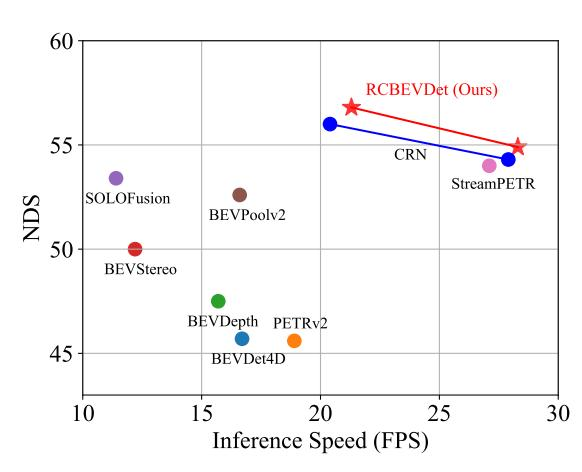
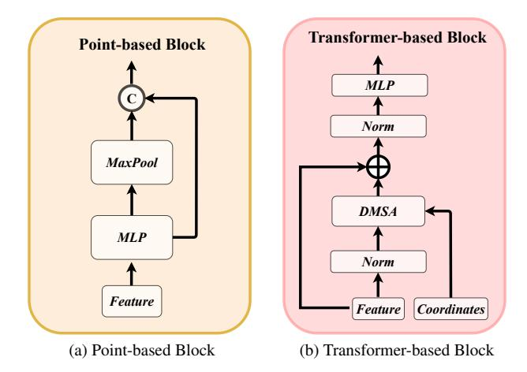
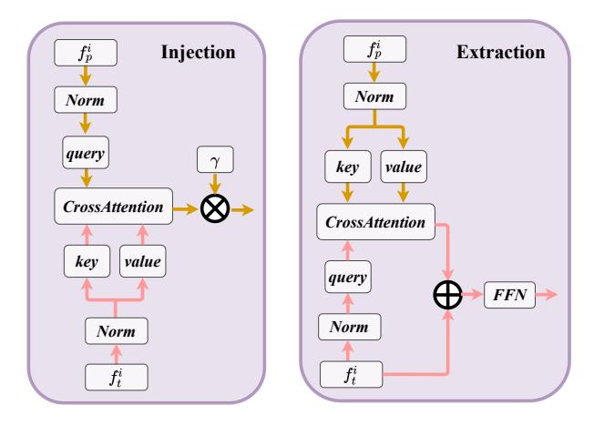

# RCBEVDet: Radar-camera Fusion in Bird's Eye View for 3D Object Detection

Zhiwei Lin1\* Zhe Liu2\* Zhongyu Xia1 Xinhao Wang1 Yongtao Wang1† Shengxiang Qi3 Yang Dong3 Nan Dong3 Le Zhang2 Ce Zhu2 1Wangxuan Institute of Computer Technology, Peking University 2School of Information and Communication Engineering, University of Electronic Science and Technology of China 3Chongqing Changan Automobile Co., Ltd.

{zwlin,wyt,xiazhongyu}@pku.edu.cn liuzhe@std.uestc.edu.cn shengxiang.qi@gmail.com {lezhang,eczhu}@uestc.edu.cn {dongyang,dongnan1}@changan.com.cn

## Abstract

*Three-dimensional object detection is one of the key tasks in autonomous driving. To reduce costs in practice, low-cost multi-view cameras for 3D object detection are proposed to replace the expansive LiDAR sensors. However, relying solely on cameras is difficult to achieve highly accurate and robust 3D object detection. An effective solution to this issue is combining multi-view cameras with the economical millimeter-wave radar sensor to achieve more reliable multi-modal 3D object detection. In this paper, we introduce RCBEVDet, a radar-camera fusion 3D object detection method in the bird's eye view (BEV). Specifically, we first design RadarBEVNet for radar BEV feature extraction. RadarBEVNet consists of a dual-stream radar backbone and a Radar Cross-Section (RCS) aware BEV encoder. In the dual-stream radar backbone, a pointbased encoder and a transformer-based encoder are proposed to extract radar features, with an injection and extraction module to facilitate communication between the two encoders. The RCS-aware BEV encoder takes RCS as the object size prior to scattering the point feature in BEV. Besides, we present the Cross-Attention Multi-layer Fusion module to automatically align the multi-modal BEV feature from radar and camera with the deformable attention mechanism, and then fuse the feature with channel and spatial fusion layers. Experimental results show that RCBEVDet achieves new state-of-the-art radar-camera fusion results on nuScenes and view-of-delft (VoD) 3D object detection benchmarks. Furthermore, RCBEVDet achieves better 3D detection results than all real-time camera-only and radar-camera 3D object detectors with a faster inference speed at 21*∼*28 FPS. The source code will be released at* https://github.com/VDIGPKU/RCBEVDet*.*

Figure 1. Comparison of the proposed RCBEVDet and other real-time 3D object detectors. Our RCBEVDet achieves stateof-the-art accuracy and accuracy-speed trade-offs. The inference speed is benchmarked by a single RTX3090 GPU.

## 1. Introduction

The rapid development of 3D object detection technology has greatly accelerated the progress of autonomous driving. Recently, researchers have focused on 3D object detection via multi-view cameras, which is economical and efficient. Specifically, multi-view cameras can capture intricate details like object color and texture, and provide highresolution semantic information for the 3D object detection task. However, relying solely on a single camera sensor cannot achieve highly accurate and robust 3D object detection. For instance, cameras cannot capture precise depth information [28] and may fail in adverse weather or low-light conditions [1, 25].

To overcome this issue, combining multi-view cameras with the economical millimeter-wave radar sensor to achieve more comprehensive and reliable multi-modal object detection is a feasible and effective solution. Millimeter wave radar sensors excel in high-precision distance measurement and velocity estimation [3], and work reliably in various weather and lighting conditions [17, 51]. Thus, millimeter wave radar sensors can provide complementary information to multi-view cameras.

Recent works [44, 49] attempt to fuse radar and image at the feature level, and most of them follow the pipeline of BEVFusion [20, 25] by projecting multi-view image features and radar features into bird's eye view (BEV). Specifically, they mainly adopt simple element-wise concatenation, summation, or SE-module as the multi-modal feature fusion module. However, these fusion methods cannot deal with the spatial misalignment between multi-view image and radar inputs. Besides, current radar-camera fusion methods [12, 13, 30] still adopt encoders (*e.g.*, PointPillars) designed for the LiDAR sensor to process radar data. Due to the natural differences between radar and LiDAR sensors, the LiDAR encoder adopted for radar data is sub-optimal.

To this end, we present a radar-camera 3D object detector dubbed RCBEVDet, which contains two key designs, *i.e.*, RadarBEVNet for efficient radar feature extraction, and Cross-Attention Multi-layer Fusion Module (CAMF) for robust radar-camera feature fusion. Specifically, Radar-BEVNet consists of two components, *i.e.*, the dual-stream radar backbone and the RCS-aware BEV encoder. The first component, *i.e.*, the dual-stream radar encoder, combines point-based and transformer-based encoders with an injection and extraction module. To be more specific, the pointbased encoder utilizes MLP to process each radar point individually, while the transformer-based encoder updates radar point features by interacting with other radar points. Besides, the injection and extraction module is proposed as a connection for the interaction between features from two encoders. In the second component, *i.e.*, the RCS-aware BEV encoder, we consider RCS as a priori of object size to scatter point features into BEV space. As for the CAMF module, since radar points often suffer from azimuth errors, we first employ a multi-modal cross-attention mechanism to dynamically align the BEV feature maps from radar and cameras. After the feature alignment, the channel and spatial fusion layers are applied to fuse the multi-modal features adaptively.

The main contributions of this work are summarized as follows:

- We present RCBEVDet, a radar-camera multi-modal 3D object detector for highly accurate, efficient, and robust 3D object detection.
- We specially design an efficient radar feature extractor for RCBEVDet, *i.e.*, RadarBEVNet, consisting of a dual-stream radar backbone to extract radar features with two representations and an RCS-aware BEV encoder to scatter the radar feature into BEV according to radar-specific RCS character.
- We introduce the Cross-Attention Multi-layer Fusion

- module with the deformable cross-attention mechanism for robust radar-camera feature alignment and fusion.
- RCBEVDet achieves new state-of-the-art radarcamera multi-modal 3D object detection results on nuScenes [2] and VoD [31]. Besides, RCBEVDet significantly improves the performance of camera-based 3D object detection methods and obtains optimal trade-off between accuracy and speed among all real-time camera-only and radar-camera 3D object detectors, as shown in Figure 1. Furthermore, RCBEVDet shows good robustness capability against sensor failure cases.

## 2. Related Work

## 2.1. Camera-based 3D Object Detection

Detecting objects in 3D space from camera images is challenging due to the lack of sufficient 3D information compared to LiDAR and radar systems. In recent years, researchers have made significant efforts to address this challenge [4, 5, 10, 19, 35, 42]. These efforts include inferring depth from images [45], utilizing geometric constraints and shape priors [27], design specific loss functions [29, 36], and exploring joint 3D detection and reconstruction optimization [21]. More recently, the emergence of multi-view camera datasets [2, 37] has led to the development of multiview 3D object detection methods [10, 19, 23, 33, 41], which can be briefly divided into two categories, *i.e.*, geometry-based methods and transformer-based methods.

Geometry-based methods mainly adopt Lift-Splat-Shoot (LSS) [33] to transform features from multi-view images into voxel or BEV features. LSS [33] employs a depth estimation network to explicitly estimate the depth distribution and a context vector for each image. The outer product of the depth and context vector determines the feature at each point in 3D space along the perspective ray. BEVDet [10] builds upon the viewpoint transformation in LSS and detects 3D objects in BEV features. BEVDepth [18] introduces explicit depth supervision to optimize depth estimation. Based on BEVDet, BEVDet4D [8] performs spatial alignment for BEV features from historical image frames and significantly improves the performance of velocity prediction.

As for Transformer-based methods, they mainly map the perspective view to a voxel or bird's eye view by constructing queries and searching the corresponding image features through attention mechanisms. BEVformer [19] introduces multi-scale deformable attention to map multi-view image features to BEV features. StreamPETR [40] proposes to utilize sparse object queries as intermediate representations to capture temporal information. SparseBEV [22] incorporates a scale-adaptive self-attention module and an adaptive

Figure 2. **Overall pipeline of RCBEVDet.** Firstly, multi-view images are encoded and transformed into the bird's eye view to obtain the image BEV feature. Concurrently, radar point clouds are sent to the proposed RadarBEVNet to extract the radar BEV feature. Afterward, BEV features from radar and cameras are aligned dynamically and aggregated with the cross-attention multi-layer fusion (CAMF). The fused semantically rich multi-modal BEV feature is employed for the 3D object detection task.

spatio-temporal sampling module to perceive the BEV and temporal information dynamically.

Our proposed RCBEVDet demonstrates that introducing additional complementary radar modality can significantly improve the 3D object detection performance while maintaining the real-time inference speed.

#### 2.2. Radar-camera 3D Object Detection

Millimeter-wave radar is a popular sensor in autonomous vehicles for 3D object detection due to its cheapness, long-range perception, and Doppler velocity measurements, which are unaffected by adverse weather conditions. However, the sparsity and lack of semantic information of the millimeter-wave radar data make radar-only 3D object detection challenging. As a result, millimeter-wave radar is often adopted as the auxiliary modality for multi-modal 3D object detection. Recently, combining multi-view cameras with millimeter-wave radar sensors for 3D object detection has attracted much attention, since millimeter-wave radar and multi-view images can provide complementary information for each other.

RadarNet [47] proposes a multi-level fusion approach to improve the accuracy of distant objects and reduce velocity errors. CenterFusion [30] utilizes a keypoint detection network to generate initial 3D detection results from images and proposes a pillar-based radar association module to associate radar features with corresponding detection results for secondary refinement. CRAFT [12] introduces a

proposal-level fusion framework that employs a Soft-Polar-Association and Spatio-Contextual Fusion Transformer to exchange information between the camera and millimeter-wave radar efficiently. RADIANT [26] designs a network for estimating the positional offset between radar echoes and object centers and leverages radar depth information to enhance camera features. CRN [13] leverages the depth information from radar to generate radar occupancy augmented images for multi-view transformation. It incorporates a cross-attention mechanism in radar-camera fusion to address spatial misalignment and information disparity between radar and camera sensors. RCFusion [49] designs radar PillarNet to generate radar pseudo-images and use a weighted fusion module to fuse radar and camera BEV features.

By contrast, our RCBEVDet proposes a handcrafted RadarBEVNet for efficient radar BEV feature extraction and introduces a Cross-Attention Multi-layer fusion module for robust multi-modal feature alignment and fusion.

#### 3. Method

The overall pipeline of RCBEVDet is shown in Figure 2. Multi-view images are sent to an image encoder to extract features. Then, a view-transformation module is applied to transform the multi-view image feature into the image BEV feature. Concurrently, aligned radar point clouds are encoded to the radar BEV feature by the proposed Radar-BEVNet. Afterward, the image and radar BEV features are

Figure 3. Architecture of the dual-stream radar backbone.

fused by Cross-attention Multi-layer Fusion module. Finally, the fused multi-modal BEV feature is used for the 3D object detection task.

#### 3.1. RadarBEVNet

Previous radar-camera fusion methods mainly adopt the radar encoder designed for LiDAR point clouds, like Point-Pillars [15]. Instead, we propose RadarBEVNet, especially for the efficient radar BEV feature extraction.

**Dual-stream radar backbone**. The dual-stream radar backbone has two backbones, *i.e.*, point-based backbone and transformer-based backbone. The point-based backbone learns local radar features, while the transformer-based backbone captures global information. Specifically, for the point-based backbone, we adopt a similar plain structure following PointNet [34]. As shown in Figure 3a, the point-based backbone has S blocks, and each block contains an MLP and a max pooling operation. The input radar point feature is first sent to the MLP to increase its feature dimension. Then, the global information is extracted by the max pooling operation over all radar points and concatenated to the high-dimension radar feature. The whole process can be formulated as:

$$f = \text{Concat}[\text{MLP}(f), \text{MaxPool}(\text{MLP}(f))].$$
 (1)

As for the transformer-based backbone, it comprises S standard transformer blocks [6, 39] with an attention mechanism, a feed-forward network, and normalization layers, as shown in Figure 3b. Due to the extensive range of autonomous driving scenarios, directly using standard self-attention can make it challenging to optimize the model. To alleviate this issue, we propose a distance-modulated self-attention mechanism (DMSA) to make the model aggregate neighbor information at the early training iteration thus facilitating model convergence. More specifically, given the coordinates of N radar points, we first calculate the pair-distance  $D \in \mathbb{R}^{N \times N}$  between all points. Then, we gener-

Figure 4. Architecture of the Injection and Extraction module. The left figure shows the details of the injection operation. The right figure displays the structure of the extraction operation.

ate the Gaussian-like weight map  ${\cal G}$  according to the pair-distance  ${\cal D}$  as:

$$G_{i,j} = \exp(-D_{i,j}^2/\sigma^2),$$
 (2)

where  $\sigma$  is a learnable parameter to control the bandwidth of the Gaussian-like distribution. Essentially, the Gaussian-like weight map G assigns high weight to spatial locations near the point and low weight to positions far from the point. We modulate the attention mechanism with the generated weight G as follows:

$$\begin{split} \mathrm{DMSA}(Q,K,V) = & \mathrm{Softmax}(\frac{QK^\top}{\sqrt{d}} + \log G)V \\ = & \mathrm{Softmax}(\frac{QK^\top}{\sqrt{d}} - \frac{1}{\sigma^2}D^2)V. \end{split} \tag{3}$$

To ensure DMSA can be degraded to vanilla self-attention, we replace  $1/\sigma$  with a trainable parameter  $\beta$  during the training. When  $\beta=0$ , DMSA is degraded to the vanilla self-attention. We also investigate the multihead DMSA. Each head has unshared  $\beta_i$  to control the receptive field of DMSA. The multi-head DMSA can be formulated as MultiHeadDMSA(Q,K,V)=Concat $[head_1,head_2,...,head_H]$ , where

$$head_{i} = DMSA(Q_{i}, K_{i}, V_{i})$$

$$= Softmax(\frac{Q_{i}K_{i}^{\top}}{\sqrt{d_{i}}} - \beta_{i}D^{2})V_{i}.$$
(4)

To better interact radar features from two different backbones, we introduce the Injection and Extraction module based on cross-attention, as shown in Figure 4. The Injection and Extraction module is applied at each block of the two backbones. Concretely, assuming the features from the  $i\ th$  block of the point-based and transformer-based backbone are  $f_p^i$  and  $f_t^i$ , respectively. In injection operation, we take  $f_p^i$  as the query and  $f_t^i$  as the key and value. We use

Figure 5. **Illustration of RCS-aware scattering.** RCS-aware scattering uses RCS as the object size prior to scatter the feature of one radar point to many BEV pixels.

multi-head cross-attention to inject transformer feature  $f_t^i$  into the point feature  $f_p^i$ , which can be formulated as:

$$f_p^i = f_p^i + \gamma \times \text{CrossAttention}(LN(f_p^i), LN(f_t^i)), \quad (5)$$

where  $L\!N$  is the LayerNorm and  $\gamma$  is a learnable scaling parameter.

Similarly, the extraction operation extract point feature  $f_p^i$  with cross-attention for the transformer-based backbone. The extraction operation is defined as:

$$f_t^i = \text{FFN}(f_t^i + \text{CrossAttention}(LN(f_t^i), LN(f_n^i))),$$
 (6)

where FFN is the FeedForward Network. The updated features  $f_p^i$  and  $f_t^i$  are sent to the next block of their corresponding backbone.

**RCS-aware BEV encoder.** Current radar BEV encoders generally scatter point features into voxel space according to the 3D coordinates of points and compress the z-axis to produce the BEV feature. However, the produced BEV feature is sparse, *i.e.*, the feature in most pixels is zero. It is difficult for some pixels to aggregate features, which may hurt the detection performance. One solution is to increase the number of BEV encoder layers. This usually results in the features of small objects being smoothed out by background features. To alleviate this problem, we propose an RCS-aware BEV encoder. Radar cross-section (RCS) measures how an object is detectable by radar. In general, a larger object would produce stronger radar wave reflections, resulting in a larger RCS measurement. Thus, RCS can provide a rough measurement of the object's size. The key design of the RCS-aware BEV encoder is RCS-aware scattering operation, which utilizes RCS as the object size prior to scatter the feature of one radar point to many pixels instead of one pixel in BEV space, as shown in Figure 5.

Figure 6. Cross-attention Multi-layer Fusion module. The BEV features from radar and cameras are dynamically aligned with the deformable cross-attention. Then, the multi-modal BEV features are aggregated with a channel and spatial fusion module, which consists of several CBR blocks.

In particular, without loss of generality, given a specific radar point and its RCS value  $V_{RCS}$ , 3D coordinate  $c=(c_x,c_y)$ , BEV pixel coordinate  $p=(p_x,p_y)$ , and feature f, we scatter f to pixel p and nearby pixels, whose pixel distance with p is smaller than  $(c_x^2+c_y^2)\times v_{RCS}$ . If a pixel in the BEV feature is scattered with more than one radar feature, we perform summation pooling to aggregate these features. In this way, we obtain the radar BEV feature  $f_{RCS}$ . Besides, we introduce a Gaussian-like BEV weight map for each point according to the RCS value as:

$$G_{x,y} = \exp\left(-\frac{(c_x - x)^2 + (c_y - y)^2}{\frac{1}{3}(c_x^2 + c_y^2) \times v_{RCS}}\right),\tag{7}$$

where x,y are the pixel coordinates. The final Gaussian-like BEV weight map  $G_{RCS}$  is obtained by maximization over all Gaussian-like BEV weight maps. We concatenate  $f_{RCS}$  with  $G_{RCS}$  and send them to an MLP to get the final RCS-aware BEV feature as:

$$f'_{RCS} = \text{MLP}(\text{Concat}(f_{RCS}, G_{RCS})).$$
 (8)

After that,  $f'_{RCS}$  is concatenated with the original BEV feature and sent to the BEV encoder, e.g., SECOND [46].

#### 3.2. Cross-Attention Multi-layer Fusion Module

#### Multi-modal Feature Alignment with Cross-Attention.

Radar point clouds often suffer from azimuth errors. Thus, radar sensors may obtain radar points out of the boundaries of objects. As a result, radar features generated by Radar-BEVNet can be assigned to adjacent BEV grids, causing the misalignment of BEV features from cameras and radar. To alleviate this issue, we use the cross-attention mechanism to align the multi-modal features dynamically. Since

| Method            | Input | Backbone | Image Size       | NDS↑ | mAP↑ | mATE↓ | mASE↓ | mAOE↓ | mAVE↓ | mAAE↓ | FPS↑ |
|-------------------|-------|----------|------------------|------|------|-------|-------|-------|-------|-------|------|
| CenterFusion [30] | C+R   | DLA34    | $448 \times 800$ | 45.3 | 33.2 | 0.649 | 0.263 | 0.535 | 0.540 | 0.142 | -    |
| CRAFT [12]        | C+R   | DLA34    | $448 \times 800$ | 51.7 | 41.1 | 0.494 | 0.276 | 0.454 | 0.486 | 0.176 | 4.1  |
| RCBEVDet (Ours)   | C+R   | DLA34    | $448 \times 800$ | 56.3 | 45.3 | 0.492 | 0.269 | 0.449 | 0.230 | 0.188 | 4.7  |
| RCBEV4d [50]      | C+R   | Swin-T   | $256 \times 704$ | 49.7 | 38.1 | 0.526 | 0.272 | 0.445 | 0.465 | 0.185 | -    |
| RCBEVDet (Ours)   | C+R   | Swin-T   | $256 \times 704$ | 56.2 | 49.6 | 0.496 | 0.271 | 0.418 | 0.239 | 0.179 | 18.2 |
| CRN [13]          | C+R   | R18      | $256 \times 704$ | 54.3 | 44.8 | 0.518 | 0.283 | 0.552 | 0.279 | 0.180 | 27.9 |
| RCBEVDet (Ours)   | C+R   | R18      | $256 \times 704$ | 54.8 | 42.9 | 0.502 | 0.291 | 0.432 | 0.210 | 0.178 | 28.3 |
| BEVDet [10]       | С     | R50      | $256 \times 704$ | 39.2 | 31.2 | 0.691 | 0.272 | 0.523 | 0.909 | 0.247 | 15.6 |
| BEVDepth [18]     | C     | R50      | $256 \times 704$ | 47.5 | 35.1 | 0.639 | 0.267 | 0.479 | 0.428 | 0.198 | 11.6 |
| SOLOFusion [32]   | C     | R50      | $256 \times 704$ | 53.4 | 42.7 | 0.567 | 0.274 | 0.411 | 0.252 | 0.188 | 11.4 |
| StreamPETR [40]   | C     | R50      | $256 \times 704$ | 54.0 | 43.2 | 0.581 | 0.272 | 0.413 | 0.295 | 0.195 | 27.1 |
| CRN [13]          | C+R   | R50      | $256 \times 704$ | 56.0 | 49.0 | 0.487 | 0.277 | 0.542 | 0.344 | 0.197 | 20.4 |
| RCBEVDet (Ours)   | C+R   | R50      | $256 \times 704$ | 56.8 | 45.3 | 0.486 | 0.285 | 0.404 | 0.220 | 0.192 | 21.3 |

Table 1. Comparison of 3D object detection results on nuScenes val set. 'C' and 'R' represent camera and radar, respectively.

unaligned radar points deviate from their true position by a small distance, we propose to employ the deformable cross-attention to capture the deviation. Besides, the deformable cross-attention can reduce the computational complexity of the vanilla cross-attention from  $O(H^2W^2C)$  to  $O(HWC^2K)$ , where H and W represent the height and width of the BEV feature, C denotes the BEV feature channels, and K is the number of the reference points in deformable cross-attention.

Specifically, as shown in Figure 6, given camera and radar BEV features denoted by  $F_c \in \mathbb{R}^{C_c \times H \times W}$ ,  $F_r \in \mathbb{R}^{C_r \times H \times W}$ , respectively, we first add learnable position embeddings to  $F_c$  and  $F_r$ . Then,  $F_r$  is transformed to queries  $z_{q_r}$  and reference points  $p_{q_r}$ , and  $F_c$  is viewed as keys and values. The multi-head deformable crossattention [53] is calculated by:

DeformAttn 
$$(z_{q_r}, p_{q_r}, F_c) =$$

$$\sum_{m=1}^{M} W_m \left[ \sum_{k=1}^{K} A_{mqk} \cdot W'_m F_c \left( p_{q_r} + \Delta p_{mqk} \right) \right], \tag{9}$$

where m indexes the attention head, k indexes the sampled keys, and K is the total sampled key number.  $\Delta p_{mqk}$  denotes the sampling offset.  $A_{mqk}$  represents attention weight calculated by  $z_{q_r}$  and  $F_c$ . We exchange  $F_r$  and  $F_c$  and conduct another deformable cross-attention to update  $F_r$ .

Finally, the Cross-Attention module in CAMF can be formulated as:

$$\begin{cases} F_c \leftarrow \text{DeformAttn}(z_{q_r}, p_{q_r}, F_c), \\ F_r \leftarrow \text{DeformAttn}(z_{q_c}, p_{q_c}, F_r). \end{cases}$$
(10)

Channel and Spatial Fusion. After aligning the BEV feature from cameras and radar by cross-attention, we propose channel and spatial fusion layers to aggregate multi-modal BEV features, as illustrated in Figure 6. Specifically, we first concatenate two BEV features as  $F_{multi} = [F_c, F_r]$ . Then,  $F_{multi}$  is sent to a CBR block with a residual connection to obtain the fused feature. The CBR block is successively composed of a Conv  $3\times3$ , a Batch Normalization,

and a ReLU activate function. After that, three CBR blocks are applied to further fuse the multi-modal features.

## 4. Experiments

## 4.1. Implementation Details.

We adopt BEVDepth [18] with several modifications as the camera stream in RCBEVDet. We accumulate the intermediate BEV feature of the previous frames and concatenate them with the BEV feature of the current frame. We follow BEVDet4D [8] to add an extra BEV encoder consisting of two residual blocks to adjust the BEV features from multi-frames before the temporal fusion. We use BEVPoolv2 [9] to accelerate the view transformation process. For radar, we accumulate multi-sweep radar points and use RCS and Doppler speed as features in the same manner as GRIFNet [11] and CRN [13]. The number of stages S in the dual-stream radar backbone is set to three.

Our models are trained in a two-stage manner. In the first stage, we train the camera stream following the standard implementation [18]. In the second stage, we train the radarcamera fusion model. The weights of the camera stream are inherited from the first stage, and the parameters of the camera stream are frozen in the second stage. All models are trained for 12 epochs with AdamW [14] optimizer. We apply both image and radar data augmentations to prevent overfitting. We adopt CBGS [52] for the class-balanced sampling. Inference time is measured on an RTX3090 GPU with a single batch and FP16 precision following CRN [13].

#### 4.2. Main Results

**NuScenes Results.** We compare the proposed RCBEVDet with previous state-of-the-art 3D detection methods on the nuScenes val and test sets in Tables 1 and 2, respectively. As shown in Table 1, RCBEVDet shows competitive 3D object detection performance, especially on the overall metrics (NDS) and velocity error (mAVE). Specifically, RCBEVDet outperforms previous radar-camera fu-

| Table 2. Comparison of 3D object detection results on nuScenes test set. 'C' and 'R' represent camera and radar, respectively. ∗ |  |
|----------------------------------------------------------------------------------------------------------------------------------|--|
| indicates the camera model in RCBEVDet, which is implemented based on the released official code.                                |  |

| Method             | Input | Backbone   | NDS↑ | mAP↑ | mATE↓ | mASE↓ | mAOE↓ | mAVE↓ | mAAE↓ |
|--------------------|-------|------------|------|------|-------|-------|-------|-------|-------|
| KPConvPillars [38] | R     | Pillars    | 13.9 | 4.9  | 0.823 | 0.428 | 0.607 | 2.081 | 1.000 |
| CenterFusion [30]  | C+R   | DLA34      | 44.9 | 32.6 | 0.631 | 0.261 | 0.516 | 0.614 | 0.115 |
| RCBEV [50]         | C+R   | Swin-T     | 48.6 | 40.6 | 0.484 | 0.257 | 0.587 | 0.702 | 0.140 |
| MVFusion [43]      | C+R   | V2-99      | 51.7 | 45.3 | 0.569 | 0.246 | 0.379 | 0.781 | 0.128 |
| CRAFT [12]         | C+R   | DLA34      | 52.3 | 41.1 | 0.467 | 0.268 | 0.456 | 0.519 | 0.114 |
| BEVFormer [19]     | C     | V2-99      | 56.9 | 48.1 | 0.582 | 0.256 | 0.375 | 0.378 | 0.126 |
| PETRv2 [24]        | C     | V2-99      | 58.2 | 49.0 | 0.561 | 0.243 | 0.361 | 0.343 | 0.120 |
| BEVDepth∗ [18]  | C     | V2-99      | 60.5 | 51.5 | 0.446 | 0.242 | 0.377 | 0.324 | 0.135 |
| BEVDepth [18]      | C     | ConvNeXt-B | 60.9 | 52.0 | 0.445 | 0.243 | 0.352 | 0.347 | 0.127 |
| BEVStereo [16]     | C     | V2-99      | 61.0 | 52.5 | 0.431 | 0.246 | 0.358 | 0.357 | 0.138 |
| SOLOFusion [32]    | C     | ConvNeXt-B | 61.9 | 54.0 | 0.453 | 0.257 | 0.376 | 0.276 | 0.148 |
| CRN [13]           | C+R   | ConvNeXt-B | 62.4 | 57.5 | 0.416 | 0.264 | 0.456 | 0.365 | 0.130 |
| SparseBEV [22]     | C     | V2-99      | 63.6 | 55.6 | 0.485 | 0.244 | 0.332 | 0.246 | 0.117 |
| StreamPETR [40]    | C     | V2-99      | 63.6 | 55.0 | 0.493 | 0.241 | 0.343 | 0.243 | 0.123 |
| RCBEVDet (Ours)    | C+R   | V2-99      | 63.9 | 55.0 | 0.390 | 0.234 | 0.362 | 0.259 | 0.113 |

Table 3. Comparison of 3D object detection results on VoD validation set. The region of interest is the driving corridor located close to the ego-vehicle. The IoU thresholds for mAP [31] are set to 0.5 for cars, 0.25 for pedestrians, and 0.25 for cyclists.

|                     |       | AP in the Entire Annotated Area (%) |            |         |       | AP in the Region of Interest (%) |            |         |       |
|---------------------|-------|-------------------------------------|------------|---------|-------|----------------------------------|------------|---------|-------|
| Method              | Input | Car                                 | Pedestrian | Cyclist | mAP   | Car                              | Pedestrian | Cyclist | mAP   |
| PointPillar [15]    | R     | 37.06                               | 35.04      | 63.44   | 45.18 | 70.15                            | 47.22      | 85.07   | 67.48 |
| RadarPillarNet [49] | R     | 39.30                               | 35.10      | 63.63   | 46.01 | 71.65                            | 42.80      | 83.14   | 65.86 |
| RCFusion [49]       | C+R   | 41.70                               | 38.95      | 68.31   | 49.65 | 71.87                            | 47.50      | 88.33   | 69.23 |
| RCBEVDet (Ours)     | C+R   | 40.63                               | 38.86      | 70.48   | 49.99 | 72.48                            | 49.89      | 87.01   | 69.80 |

Table 4. Ablation of the main components of RCBEVDet. We successively add components to BEVDepth [18] and compose RCBEVDet. Each component improves the 3D detection performance consistently.

| Model Configuration     | Input | NDS       | mAP       |
|-------------------------|-------|-----------|-----------|
| BEVDepth [18]           | C     | 47.5      | 35.1      |
| + Temporal              | C     | 51.9 ↑4.4 | 40.5 ↑5.4 |
| + PointPillar+BEVFusion | C+R   | 53.6 ↑1.7 | 42.3 ↑1.8 |
| + RadarBEVNet           | C+R   | 55.7 ↑2.1 | 45.3 ↑3.0 |
| + CAMF                  | C+R   | 56.4 ↑0.7 | 45.6 ↑0.3 |
| + Temporal Supervision  | C+R   | 56.8 ↑0.4 | 45.3 ↓0.3 |

sion methods under various backbone settings with a faster inference speed. Notably, RCBEVDet with ResNet-50 reduces the velocity error (mAVE) by 14.7% and 37.5% compared to the previous best camera-only method (SOLOFusion) and radar-camera method (CRN), respectively. Furthermore, RCBEVDet surpasses all camera-based 3D detection methods, showing the effectiveness of using complementary radar information for better 3D detection.

On test sets, RCBEVDet improves the baseline (BEVDepth) results by 3.4 NDS and 3.5 mAP. It is worth noting that we can further improve the performance of RCBEVDet by adopting a stronger detection baseline, such as StreamPETR [40]. Besides, RCBEVDet with a smaller V2-99 backbone can surpass the radar-camera fusion method CRN with ConvNeXt-Base by 1.5 NDS.

VoD Results. To further demonstrate the effectiveness of RCBEVDet, we train RCBEVDet on the 4D millimeterwave radar dataset, *i.e.*, view-of-delft (VoD). We report the results of RCBEVDet on the VoD validation set in Table 3. In the entire area, RCBEVDet surpasses RCFusion by 0.34 mAP. As for the region of interest, RCBEVDet also achieves state-of-the-art results with 69.80 mAP.

## 4.3. Ablation Studies

We conduct ablation studies on nuScenes val set to analyze the effectiveness of each setting of RCBEVDet. We adopt RCBEVDet with R50 backbone, 256×704 image size, and 128 × 128 BEV size as the baseline model.

Main Components. RCBEVDet improves over the BEVDepth by combining it with several main components described in Section 3. To evaluate the effectiveness of each component, we successively add components to a baseline BEVDepth and compose RCBEVDet. As shown in Table 4, we observe that each component consistently improves performance. For the camera-only model, adding temporal information by accumulating BEV features from multi-frames can bring 4.4 NDS and 5.4 mAP improvement. Based on the camera-only model, we build a radarcamera 3D object detection baseline by adopting PointPil-

Table 5. Ablation of RadarBEVNet.

| Radar Backbone                    | NDS               | mAP               |
|-----------------------------------|-------------------|-------------------|
| Point Backbone                    | 54.3              | 42.6              |
| + RCS-aware BEV encoder           | 55.7 1.4          | 44.5 <b>↑</b> 1.9 |
| + Transformer Backbone            | 55.8 ↑0.1         | 44.8 ↑0.3         |
| + Injection and Extraction module | <b>56.4 ↑</b> 0.6 | <b>45.6 ↑</b> 0.8 |

Table 6. Ablation of CAMF.

| Fusion Method                | NDS               | mAP               |
|------------------------------|-------------------|-------------------|
| BEVFusion [25]               | 55.7              | 45.3              |
| + Deformable Cross-Attention | 56.1 <b>↑</b> 0.4 | 45.5 ↑0.2         |
| + Channel and Spatial Fusion | <b>56.4 ↑</b> 0.3 | <b>45.6 ↑</b> 0.1 |

lar as the radar backbone and BEVFusion [20] as the fusion method, which uses a convolutional layer and SE [7] to fuse multi-model BEV features. The baseline radar-camera detector can achieve 53.6 NDS and 42.3 mAP. By replacing PointPillar with the proposed RadarBEVNet, we obtain 2.1 NDS and 3.0 mAP improvement, showing the excellent radar feature representation ability of RadarBEVNet. Moreover, the proposed CAMF can further improve the detection performance from 55.7 NDS to 56.4 NDS. Additionally, following HoP [54], we add extra losses to supervise the output of each frame, named Temporal Supervision. This can improve 0.4 NDS while decreasing 0.3 mAP.

Overall, the results demonstrate the effectiveness of each component proposed in RCBEVDet. Meanwhile, the results indicate that multi-module fusion is essential for the 3D object detection task.

**RadarBEVNet.** We conduct the ablation experiments for the design of RadarBEVNet, including the Dual-stream radar backbone and RCS-aware BEV encoder, as shown in Table 5. The baseline model, which replaces RadarBEVNet with a single Point-based backbone, can achieve 54.3 NDS and 42.6 mAP. By using the RCS-aware BEV encoder, we can improve the performance of 3D detection by 1.4 NDS and 1.9 mAP, showing the effectiveness of the proposed RCS-aware BEV feature reconstruction. Besides, we observe that directly adding the Transformer-based Backbone brings marginal performance improvement. The reason is that the Point-based backbone and the Transformer-based Backbone process radar points individually. The different radar feature representations of two backbones cannot be merged well. To overcome this issue, the Injection and Extraction module is introduced and brings performance gain with 0.6 NDS and 0.8 mAP.

**CAMF module.** We conducted ablation experiments on the CAMF module, including the deformable cross-attention mechanism for multi-modal alignment and the channel and spatial fusion module, as shown in Table 6. The baseline model with the fusion module in BEVfusion [25] can achieve 55.7 NDS and 45.3 mAP. Incorporating the Deformable Cross Attention for BEV features alignment

Table 7. **Analysis of Robustness**. We report *Car* class mAP in the same manner as CRN [13].

|                  | Innut | Dron | # of view drops |      |      |      |
|------------------|-------|------|-----------------|------|------|------|
|                  | Input | Drop | 0               | 1    | 3    | All  |
| BEVDepth [18]    | С     | С    | 49.4            | 41.1 | 24.2 | 0    |
| CenterPoint [48] | R     | R    | 30.6            | 25.3 | 14.9 | 0    |
| BEVFusion [25]   | C+R   | С    | 63.9            | 58.5 | 45.7 | 14.3 |
|                  |       | R    |                 | 59.9 | 50.9 | 34.4 |
| CRN [13]         | C+R   | С    | 68.8            | 62.4 | 48.9 | 12.8 |
|                  |       | R    |                 | 64.3 | 57.0 | 43.8 |
| RCBEVDet (Ours)  | C+R   | С    | 72.5            | 66.9 | 53.5 | 16.5 |
|                  |       | R    |                 | 71.6 | 66.1 | 62.1 |

yields 3D detection performance improvement from 55.7 NDS to 56.1 NDS and 45.3 mAP to 45.5 mAP. The results demonstrate the effectiveness of the cross-modal alignment capability of the cross-attention mechanism. Besides, we observed that introducing the channel and spatial fusion module for BEV feature fusion resulted in a higher performance of 0.3 NDS and 0.1 mAP than one-layer fusion in BEVFusion [25].

## 4.4. Analysis of Robustness

We randomly drop images or radar inputs to analyze the robustness in sensor failure cases. We use the dropout training strategy as the data augmentation to train RCBEVDet in this experiment following CRN [13]. The results with *Car* class mAP are present in Table 7. RCBEVDet outperforms CRN and BEVFusion with higher *Car* class mAP in every sensor failure case. Notably, the performance of CRN [13] decreases by 4.5, 11.8, and 25.0 mAP in three radar sensor failure cases, while RCBEVDet only drops by 0.9, 6.4, and 10.4 mAP. The results demonstrate that the proposed crossattention module can produce a more robust BEV feature with the dynamic BEV feature alignment.

### 5. Conclusion

In this paper, we present RCBEVDet, a radar-camera multimodal 3D object detector in the bird's eye view. We specially design RadarBEVNet for efficient radar BEV feature extraction with a dual-stream radar backbone and an RCS-aware BEV encoder. Besides, we propose a CAMF module to dynamically align radar-camera BEV features and achieve robust 3D object detection. Experimental results show that, with radar sensors, RCBEVDet obtains a significant performance gain over camera-based 3D object detection methods, while maintaining real-time inference speed. Furthermore, RCBEVDet achieves new state-of-theart radar-camera fusion results on nuScenes and VoD 3D object detection benchmarks.

**Acknowledgements.** This work was supported by National Key R&D Program of China (Grant No. 2022ZD0160305).

## References

- [1] Mario Bijelic, Tobias Gruber, Fahim Mannan, Florian Kraus, Werner Ritter, Klaus Dietmayer, and Felix Heide. Seeing through fog without seeing fog: Deep multimodal sensor fusion in unseen adverse weather. In *CVPR*, 2020. 1
- [2] Holger Caesar, Varun Bankiti, Alex H. Lang, Sourabh Vora, Venice Erin Liong, Qiang Xu, Anush Krishnan, Yu Pan, Giancarlo Baldan, and Oscar Beijbom. nuscenes: A multimodal dataset for autonomous driving. In *CVPR*, 2020. 2
- [3] Gregory L Charvat. *Small and short-range radar systems*. CRC Press, 2014. 2
- [4] Yongjian Chen, Lei Tai, Kai Sun, and Mingyang Li. Monopair: Monocular 3d object detection using pairwise spatial relationships. In *CVPR*, 2020. 2
- [5] Zehui Chen, Zhenyu Li, Shiquan Zhang, Liangji Fang, Qinhong Jiang, and Feng Zhao. Graph-detr3d: rethinking overlapping regions for multi-view 3d object detection. In *ACM MM*, 2022. 2
- [6] Alexey Dosovitskiy, Lucas Beyer, Alexander Kolesnikov, Dirk Weissenborn, Xiaohua Zhai, Thomas Unterthiner, Mostafa Dehghani, Matthias Minderer, Georg Heigold, Sylvain Gelly, Jakob Uszkoreit, and Neil Houlsby. An image is worth 16x16 words: Transformers for image recognition at scale. In *ICLR*, 2020. 4
- [7] Jie Hu, Li Shen, and Gang Sun. Squeeze-and-excitation networks. In *CVPR*, 2018. 8
- [8] Junjie Huang and Guan Huang. Bevdet4d: Exploit temporal cues in multi-camera 3d object detection. *arXiv preprint arXiv:2203.17054*, 2022. 2, 6
- [9] Junjie Huang and Guan Huang. Bevpoolv2: A cutting-edge implementation of bevdet toward deployment. *arXiv preprint arXiv:2211.17111*, 2022. 6
- [10] Junjie Huang, Guan Huang, Zheng Zhu, Yun Ye, and Dalong Du. Bevdet: High-performance multi-camera 3d object detection in bird-eye-view. *arXiv preprint arXiv:2112.11790*, 2021. 2, 6
- [11] Youngseok Kim, Jun Won Choi, and Dongsuk Kum. Grif net: Gated region of interest fusion network for robust 3d object detection from radar point cloud and monocular image. In *IROS*, 2020. 6
- [12] Youngseok Kim, Sanmin Kim, Jun Won Choi, and Dongsuk Kum. Craft: Camera-radar 3d object detection with spatiocontextual fusion transformer. In *AAAI*, 2023. 2, 3, 6, 7
- [13] Youngseok Kim, Juyeb Shin, Sanmin Kim, In-Jae Lee, Jun Won Choi, and Dongsuk Kum. Crn: Camera radar net for accurate, robust, efficient 3d perception. In *ICCV*, 2023. 2, 3, 6, 7, 8
- [14] Diederik P Kingma and Jimmy Ba. Adam: A method for stochastic optimization. In *ICLR*, 2015. 6
- [15] Alex H Lang, Sourabh Vora, Holger Caesar, Lubing Zhou, Jiong Yang, and Oscar Beijbom. Pointpillars: Fast encoders for object detection from point clouds. In *CVPR*, 2019. 4, 7
- [16] Peiliang Li, Xiaozhi Chen, and Shaojie Shen. Stereo r-cnn based 3d object detection for autonomous driving. In *CVPR*, 2019. 7

- [17] Peizhao Li, Pu Wang, Karl Berntorp, and Hongfu Liu. Exploiting temporal relations on radar perception for autonomous driving. In *CVPR*, 2022. 2
- [18] Yinhao Li, Zheng Ge, Guanyi Yu, Jinrong Yang, Zengran Wang, Yukang Shi, Jianjian Sun, and Zeming Li. Bevdepth: Acquisition of reliable depth for multi-view 3d object detection. In *AAAI*, 2023. 2, 6, 7, 8
- [19] Zhiqi Li, Wenhai Wang, Hongyang Li, Enze Xie, Chonghao Sima, Tong Lu, Yu Qiao, and Jifeng Dai. Bevformer: Learning bird's-eye-view representation from multi-camera images via spatiotemporal transformers. In *ECCV*, 2022. 2, 7
- [20] Tingting Liang, Hongwei Xie, Kaicheng Yu, Zhongyu Xia, Zhiwei Lin, Yongtao Wang, Tao Tang, Bing Wang, and Zhi Tang. Bevfusion: A simple and robust lidar-camera fusion framework. In *NeurIPS*, 2022. 2, 8
- [21] Feng Liu and Xiaoming Liu. Voxel-based 3d detection and reconstruction of multiple objects from a single image. *NeurIPS*, 2021. 2
- [22] Haisong Liu, Yao Teng, Tao Lu, Haiguang Wang, and Limin Wang. Sparsebev: High-performance sparse 3d object detection from multi-camera videos. In *ICCV*, 2023. 2, 7
- [23] Yingfei Liu, Tiancai Wang, Xiangyu Zhang, and Jian Sun. Petr: Position embedding transformation for multi-view 3d object detection. In *ECCV*, 2022. 2
- [24] Yingfei Liu, Junjie Yan, Fan Jia, Shuailin Li, Aqi Gao, Tiancai Wang, and Xiangyu Zhang. Petrv2: A unified framework for 3d perception from multi-camera images. In *ICCV*, 2023. 7
- [25] Zhijian Liu, Haotian Tang, Alexander Amini, Xinyu Yang, Huizi Mao, Daniela L Rus, and Song Han. Bevfusion: Multitask multi-sensor fusion with unified bird's-eye view representation. In *ICRA*, 2023. 1, 2, 8
- [26] Yunfei Long, Abhinav Kumar, Daniel D. Morris, Xiaoming Liu, Marcos Castro, and Punarjay Chakravarty. RADIANT: radar-image association network for 3d object detection. In *AAAI*, 2023. 3
- [27] Yan Lu, Xinzhu Ma, Lei Yang, Tianzhu Zhang, Yating Liu, Qi Chu, Junjie Yan, and Wanli Ouyang. Geometry uncertainty projection network for monocular 3d object detection. In *ICCV*, 2021. 2
- [28] Xinzhu Ma, Yinmin Zhang, Dan Xu, Dongzhan Zhou, Shuai Yi, Haojie Li, and Wanli Ouyang. Delving into localization errors for monocular 3d object detection. In *CVPR*, 2021. 1
- [29] Zhenwei Miao, Jikai Chen, Hongyu Pan, Ruiwen Zhang, Kaixuan Liu, Peihan Hao, Jun Zhu, Yang Wang, and Xin Zhan. Pvgnet: A bottom-up one-stage 3d object detector with integrated multi-level features. In *CVPR*, 2021. 2
- [30] Ramin Nabati and Hairong Qi. Centerfusion: Center-based radar and camera fusion for 3d object detection. In *WACV*, 2021. 2, 3, 6, 7
- [31] Andras Palffy, Ewoud Pool, Srimannarayana Baratam, Julian FP Kooij, and Dariu M Gavrila. Multi-class road user detection with 3+ 1d radar in the view-of-delft dataset. *IEEE Robotics and Automation Letters*, 2022. 2, 7
- [32] Jinhyung Park, Chenfeng Xu, Shijia Yang, Kurt Keutzer, Kris M. Kitani, Masayoshi Tomizuka, and Wei Zhan. Time

- will tell: New outlooks and A baseline for temporal multiview 3d object detection. In *ICLR*, 2023. 6, 7
- [33] Jonah Philion and Sanja Fidler. Lift, splat, shoot: Encoding images from arbitrary camera rigs by implicitly unprojecting to 3d. In *ECCV*, 2020. 2
- [34] Charles R Qi, Hao Su, Kaichun Mo, and Leonidas J Guibas. Pointnet: Deep learning on point sets for 3d classification and segmentation. In *CVPR*, 2017. 4
- [35] Shaoshuai Shi, Zhe Wang, Jianping Shi, Xiaogang Wang, and Hongsheng Li. From points to parts: 3d object detection from point cloud with part-aware and part-aggregation network. *IEEE TPAMI*, 2020. 2
- [36] Andrea Simonelli, Samuel Rota Bulo, Lorenzo Porzi, Elisa Ricci, and Peter Kontschieder. Towards generalization across depth for monocular 3d object detection. In *ECCV*, 2020. 2
- [37] Pei Sun, Henrik Kretzschmar, Xerxes Dotiwalla, Aurelien Chouard, Vijaysai Patnaik, Paul Tsui, James Guo, Yin Zhou, Yuning Chai, Benjamin Caine, Vijay Vasudevan, Wei Han, Jiquan Ngiam, Hang Zhao, Aleksei Timofeev, Scott Ettinger, Maxim Krivokon, Amy Gao, Aditya Joshi, Yu Zhang, Jonathon Shlens, Zhifeng Chen, and Dragomir Anguelov. Scalability in perception for autonomous driving: Waymo open dataset. In *CVPR*, 2020. 2
- [38] Michael Ulrich, Sascha Braun, Daniel Kohler, Daniel ¨ Niederlohner, Florian Faion, Claudius Gl ¨ aser, and Holger ¨ Blume. Improved orientation estimation and detection with hybrid object detection networks for automotive radar. In *IEEE ITSC*, 2022. 7
- [39] Ashish Vaswani, Noam Shazeer, Niki Parmar, Jakob Uszkoreit, Llion Jones, Aidan N Gomez, Łukasz Kaiser, and Illia Polosukhin. Attention is all you need. In *NeurIPS*, 2017. 4
- [40] Shihao Wang, Yingfei Liu, Tiancai Wang, Ying Li, and Xiangyu Zhang. Exploring object-centric temporal modeling for efficient multi-view 3d object detection. In *ICCV*, 2023. 2, 6, 7
- [41] Tai Wang, Xinge Zhu, Jiangmiao Pang, and Dahua Lin. Fcos3d: Fully convolutional one-stage monocular 3d object detection. In *ICCV*, 2021. 2
- [42] Xinshuo Weng and Kris Kitani. Monocular 3d object detection with pseudo-lidar point cloud. In *ICCVW*, 2019. 2
- [43] Zizhang Wu, Guilian Chen, Yuanzhu Gan, Lei Wang, and Jian Pu. Mvfusion: Multi-view 3d object detection with semantic-aligned radar and camera fusion. In *ICRA*, 2023. 7
- [44] Weiyi Xiong, Jianan Liu, Tao Huang, Qing-Long Han, Yuxuan Xia, and Bing Zhu. Lxl: Lidar exclusive lean 3d object detection with 4d imaging radar and camera fusion. *arXiv preprint arXiv:2307.00724*, 2023. 2
- [45] Xianfa Xu, Zhe Chen, and Fuliang Yin. Monocular depth estimation with multi-scale feature fusion. *IEEE Signal Processing Letters*, 2021. 2
- [46] Yan Yan, Yuxing Mao, and Bo Li. Second: Sparsely embedded convolutional detection. *Sensors*, 2018. 5
- [47] Bin Yang, Runsheng Guo, Ming Liang, Sergio Casas, and Raquel Urtasun. Radarnet: Exploiting radar for robust perception of dynamic objects. In *ECCV*, 2020. 3
- [48] Tianwei Yin, Xingyi Zhou, and Philipp Krahenbuhl. Centerbased 3d object detection and tracking. In *CVPR*, 2021. 8

- [49] Lianqing Zheng, Sen Li, Bin Tan, Long Yang, Sihan Chen, Libo Huang, Jie Bai, Xichan Zhu, and Zhixiong Ma. Rcfusion: Fusing 4d radar and camera with bird's-eye view features for 3d object detection. *IEEE Transactions on Instrumentation and Measurement*, 2023. 2, 3, 7
- [50] Taohua Zhou, Junjie Chen, Yining Shi, Kun Jiang, Mengmeng Yang, and Diange Yang. Bridging the view disparity between radar and camera features for multi-modal fusion 3d object detection. *IEEE Transactions on Intelligent Vehicles*, 2023. 6, 7
- [51] Yi Zhou, Lulu Liu, Haocheng Zhao, Miguel Lopez-Ben ´ ´ıtez, Limin Yu, and Yutao Yue. Towards deep radar perception for autonomous driving: Datasets, methods, and challenges. *Sensors*, 2022. 2
- [52] Benjin Zhu, Zhengkai Jiang, Xiangxin Zhou, Zeming Li, and Gang Yu. Class-balanced grouping and sampling for point cloud 3d object detection. *arXiv preprint arXiv:1908.09492*, 2019. 6
- [53] Xizhou Zhu, Weijie Su, Lewei Lu, Bin Li, Xiaogang Wang, and Jifeng Dai. Deformable DETR: deformable transformers for end-to-end object detection. In *ICLR*, 2021. 6
- [54] Zhuofan Zong, Dongzhi Jiang, Guanglu Song, Zeyue Xue, Jingyong Su, Hongsheng Li, and Yu Liu. Temporal enhanced training of multi-view 3d object detector via historical object prediction. In *ICCV*, 2023. 8
